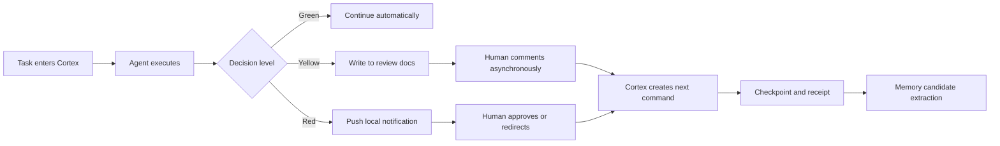

# Cortex Workflow P0

Cortex Workflow P0 is a local-first runtime for asynchronous human-agent collaboration.

It turns docs, comments, decisions, agent handoffs, receipts, and durable memory into one auditable workflow loop. The current P0 focuses on a narrow but practical goal: make multi-agent work continue without needing a custom frontend.

## What It Does

- Routes work into a SQLite-backed execution kernel: `projects`, `commands`, `decisions`, `runs`, `checkpoints`, `outbox`, and `receipts`.
- Uses Notion as the async collaboration surface through Notion Custom Agents, page comments, and MCP-visible pages. Local token-based page mirroring is now legacy and opt-in.
- Escalates red decisions to local macOS notifications, while yellow and green work stays in documents for async review.
- Lets external agents register, claim work, execute, report progress, and complete tasks through HTTP APIs or handoff receipts.
- Extracts candidate memory from stable collaboration signals, then keeps durable memory governed by source, evidence, confidence, and freshness.

## P0 Workflow



## Current Status

This repository is a P0 alpha. The backend runtime, SQLite truth source, multi-agent routing, local red-decision notifications, memory candidate flow, and Notion Custom Agent API surface are implemented and covered by tests.

Still being finalized:

- Final Notion workspace hookup for Custom Agent trigger, MCP endpoint, and in-thread reply behavior.
- Longer-running `launchd + local_notification` soak observation beyond the short-cycle smoke already passing.

Operational hardening already in place:

- `runtime:readiness` now returns `ready` on the local `PRJ-cortex` runtime after backlog cleanup.
- `runtime:soak` can now turn repeated readiness checks into a summarized soak report.
- `agent:live-uat` can now exercise the six core Notion Custom Agent scenarios against a live Cortex runtime without polluting the main project.
- Historical smoke residue can be archived through `npm run runtime:cleanup -- --project PRJ-cortex --max-age-hours 24`.

## Key Docs

- [Protocol](./PROTOCOL.md)
- [Notion Custom Agents Collaboration](./docs/notion-custom-agents-collaboration.md)
- [MVP Readiness](./docs/prj-cortex-mvp-readiness.md)
- [External Agent Onboarding](./docs/external-agent-onboarding.md)
- [Memory Extraction Plan](./docs/cortex-vnext-memory-extraction-plan.md)
- [Memory Compiler Architecture](./docs/cortex-vnext-memory-compiler-architecture.md)

## 运行

```bash
cd /path/to/cortex-workflow-p0
npm start
```

一键拉起 Cortex 本地运行栈：

```bash
npm run dev:stack
```

如果要跑完整协作骨架，默认只需要两条进程：

```bash
npm start
PANGHU_SEND_MODE=http PANGHU_SEND_URL=http://your-im-gateway npm run panghu:poll
```

如果要把 Notion 评论队列自动执行掉，再加一条 executor worker：

```bash
AGENT_NAME=agent-notion-worker \
SOURCE=notion_comment \
EXECUTOR_MODE=echo \
npm run executor:worker
```

如果要跑真实多 agent handler + 常驻 worker 池，直接用自动化启动器：

```bash
NOTIFICATION_CHANNEL=hiredcity \
NOTIFICATION_TARGET=your-target@example.com \
npm run automation:start
```

如果你这台机器就是本地 macOS，红灯唤醒现在可以直接走系统通知，不再依赖胖虎 / tunnel：

```bash
LOCAL_NOTIFICATION_ENABLE=1 \
NOTIFICATION_CHANNEL=local_notification \
CORTEX_DEFAULT_CHANNEL=local_notification \
PANGHU_POLL_ENABLE=0 \
npm run automation:start
```

这会额外拉起 `local-notifier`，把 `red decision` 从 outbox 直接投递到 macOS 通知中心。

默认主路径已经切到 `Custom Agent + MCP`。本地执行链路不会再自动把 Notion 当成主动推送目标，也不会再由本地 token 回写 discussion；`NOTION_API_KEY` 相关脚本只保留给迁移、回填或临时镜像使用。

要把它做成本地开机自启，用 `launchd`，不要用 `systemd`：

```bash
npm run launchd:install
npm run launchd:status
```

`launchd` 安装后会每 15 秒跑一次 `automation:ensure`。
也就是说：

- 登录后自动拉起 Cortex 自动化栈
- 核心进程挂掉后自动补拉
- 配置仍然从项目 `.env.local` / `.env` 读取

如果胖虎真实发送端不在本机，而是在 Red Lobbi / 另一台机器上暴露 HTTP 端点，优先直接切 `http sender`：

```bash
NOTION_API_KEY=ntn_xxx \
NOTION_PROJECT_INDEX_DATABASE_ID=your_db_id \
NOTIFICATION_CHANNEL=hiredcity \
NOTIFICATION_TARGET=your-target@example.com \
PANGHU_SEND_MODE=http \
PANGHU_SEND_URL=http://<red-lobbi-host>:<port>/send-hi \
PANGHU_SEND_TOKEN=your-token \
npm run automation:start
```

或者直接用仓内启动脚本：

```bash
bash scripts/start-red-lobbi-http.sh http://<red-lobbi-host>:<port>/send-hi your-token
```

默认保护：

- `automation:start` 现在默认要求 `panghu-poller` 使用真实 sender
- 如果 `PANGHU_SEND_MODE=stdout|file`，会直接跳过 `panghu-poller`，不会假装“已送达企业 IM”
- 只有两种情况会真的拉起常驻 `panghu-poller`
  - 配了 `PANGHU_SEND_MODE=http` 且有 `PANGHU_SEND_URL`
  - 配了 `PANGHU_SEND_MODE=command` 且有 `PANGHU_SEND_COMMAND`
- 如果你只是本地 smoke，才显式加：

```bash
PANGHU_ALLOW_DRY_RUN=1 npm run automation:start
```

这会起：

- `executor-multi-agent-handler`
- `executor-worker-agent-router`
- `executor-worker-agent-notion-worker`
- `executor-worker-agent-pm`
- `executor-worker-agent-architect`

如果要直接造一条真实 handoff 做 live 验证：

```bash
CORTEX_BASE_URL=http://192.168.0.10:19100 \
CHANNEL=hiredcity \
SESSION_ID=your-target@example.com \
npm run handoff:live -- "请接手这条 live 验证任务，发出后自动回写 delivery receipt"
```

如果要直接看 live handoff 卡在哪一层：

```bash
CORTEX_SERVER_URL=http://127.0.0.1:19100 \
PROJECT_ID=PRJ-cortex-e2e-live \
COMMAND_ID=CMD-20260403-018 \
npm run live:status
```

查看状态：

```bash
npm run automation:status
```

`automation:status` 里会直接显示 `panghu-poller` 的 sender 状态，方便判断当前是 `real sender` 还是 `dry-run`。

快速做一轮本地运行态体检：

```bash
npm run runtime:readiness -- --samples 3 --interval-ms 5000
```

如果想把本地红灯通知也一起验掉：

```bash
npm run runtime:readiness -- --samples 3 --interval-ms 5000 --red-smoke
```

如果要把历史 smoke / 验收残留从 readiness backlog 里安全归档：

```bash
npm run runtime:cleanup -- --project PRJ-cortex --max-age-hours 24
```

真正执行归档时再加 `--apply`。

这个脚本会汇总：

- `automation:status`
- `/health`
- `launchd:status`
- 最近 failed command / failed outbox / pending outbox
- 最近 receipt
- 当前待拍板 red decision

如果要把多轮 readiness 观察收口成一份 soak 报告：

```bash
npm run runtime:soak -- --project PRJ-cortex --iterations 6 --interval-ms 60000 --samples 1
```

如果要对当前 Cortex 运行态直接跑一遍 `Notion Custom Agent` 六场景 live UAT：

```bash
npm run agent:live-uat -- \
  --template-project PRJ-cortex \
  --project PRJ-cortex-live-uat-20260429 \
  --agent agent-live-uat-runtime
```

这个命令会验证：

- `green -> command`
- `yellow -> decision_request`
- `red -> decision_request + outbox`
- `self-loop guard`
- `scope guard`
- `receipt -> command done + checkpoint`

并在验完后自动归档临时 red outbox，避免污染主 runtime 的 readiness。

如果要直接看“为什么现在还没真正接入成功一个 Notion Custom Agent”，用：

```bash
npm run agent:setup-bundle -- --project PRJ-cortex
```

这条命令会直接告诉你：

- 本地 `cortex-custom-agent-mcp` 是否健康
- `/notion/custom-agent/context` 是否正常
- 当前是否已经配置可用的公网 HTTPS MCP URL
- Notion 里该填哪些 trigger、tools、Header

如果只是临时托底，才用本地 stub：

```bash
npm run executor:stub
```

默认监听：

```bash
http://127.0.0.1:19100
```

测试：

```bash
npm test
```

真实多 agent 执行链路 live smoke：

```bash
npm run executor:smoke
```

外部 Agent 接入灰度验收：

```bash
npm run agent:onboarding-smoke -- \
  --mode sync \
  --base-url http://127.0.0.1:19100 \
  --project PRJ-cortex-gray-sync \
  --agent agent-gray-sync \
  --alias gray-sync
```

如果要验 `handoff + receipt` 双向回执：

```bash
npm run agent:onboarding-smoke -- \
  --mode handoff \
  --base-url http://127.0.0.1:19100 \
  --project PRJ-cortex-gray-handoff \
  --agent agent-gray-handoff \
  --alias gray-handoff
```

第二条命令会完整验证：

- Connect onboarding
- network health verify
- Notion comment -> command ingest
- external webhook handoff
- `agent-receipt` 回写
- checkpoint / receipt 落库

把 review / execution / project index 一次性同步到 Notion：

```bash
NOTION_API_KEY=ntn_xxx NOTION_PROJECT_INDEX_DATABASE_ID=your_db_id npm run notion:sync-all
```

项目索引默认按 checkpoint 去重。
如果当前任务 / 核心进展 / 风险状态 / 下一步没有形成新 checkpoint，`project-index:notion-sync` 会直接跳过，不再新增一行。

如果历史里已经堆出了连续重复 checkpoint，可以直接清理：

```bash
NOTION_API_KEY=ntn_xxx NOTION_PROJECT_INDEX_DATABASE_ID=your_db_id npm run project-index:dedupe
```

如果想自定义数据库位置：

```bash
CORTEX_DB_PATH=/tmp/cortex.db npm start
```

启动胖虎本地轮询：

```bash
cd /path/to/cortex-workflow-p0
PANGHU_SEND_MODE=stdout npm run panghu:poll
```

这条命令仍然允许本地 dry-run。
只有当你显式设置 `PANGHU_REQUIRE_REAL_SENDER=1` 时，`stdout/file` 才会被拒绝。

如果想把“发送结果”落成文件而不是直接打印：

```bash
PANGHU_SEND_MODE=file PANGHU_SEND_FILE=/tmp/panghu-messages.jsonl npm run panghu:poll
```

如果你已经有企业 IM 网关 HTTP 入口，可以直接让胖虎用 `http` 模式发送：

```bash
PANGHU_SEND_MODE=http \
PANGHU_SEND_URL=http://127.0.0.1:3000/panghu/send \
PANGHU_SEND_TOKEN=your-token \
npm run panghu:poll
```

如果这个发送入口其实挂在 Red Lobbi，而不是本机 QClaw/OpenClaw，推荐直接复用同一套 `http sender`，不要再把本地 CLI 当成真实发送端：

```bash
bash scripts/start-red-lobbi-http.sh http://<red-lobbi-host>:<port>/send-hi your-token
```

Codex 直接发一条普通消息到 HiredCity：

```bash
TARGET=your-target@example.com PRIORITY=normal npm run codex:message -- "🟢 普通消息内容"
```

Codex 直接发一条紧急消息到 HiredCity：

```bash
TARGET=your-target@example.com PRIORITY=urgent npm run codex:message -- "🔴 红灯决策需拍板"
```

模拟一条企业 IM 文本消息：

```bash
npm run im:send -- "继续推进胖虎联调"
```

直接造一个红灯决策，观察胖虎 push：

```bash
npm run red:decision -- "是否切换到新的召回链路？" "建议切换，避免下游实现继续漂移。"
```

如果当前默认通知通道是 `local_notification`，这条命令会直接弹本地系统通知，不再要求显式 `session_id`。

如果你只是想验证本地红灯链路已经闭环：

```bash
npm run local:red-smoke
```

如果想直接看 outbox 已发历史，而不是只看 pending：

```bash
curl 'http://127.0.0.1:19100/outbox?status=sent&limit=5'
curl 'http://127.0.0.1:19100/outbox?status=sent&session_id=cli-red@local&limit=5'
```

本地一键闭环联调：

```bash
npm run e2e:local
```

模拟一条企业 IM 按钮 / 动作回流：

```bash
TARGET_ID=DR-20260324-001 npm run im:action -- approve_1 "按推荐方案继续推进"
```

跑一遍“红灯推送 -> 胖虎发送 -> 用户动作回流 -> agent 执行完成”的 round-trip：

```bash
npm run e2e:roundtrip
```

更新项目的 Notion root page 和 review 窗口：

```bash
curl -X POST http://127.0.0.1:19100/projects/upsert \
  -H 'Content-Type: application/json' \
  -d '{
    "project_id": "PRJ-cortex",
    "root_page_url": "https://www.notion.so/project/cortex-review-page",
    "review_window_note": "每天 11:30 / 18:30 review",
    "notification_channel": "hiredcity",
    "notification_target": "your-target@example.com",
    "notion_parent_page_id": "xxxxxxxxxxxxxxxxxxxxxxxxxxxxxxxx"
  }'
```

也可以直接用脚本：

```bash
PROJECT_ID=PRJ-cortex \
NOTIFICATION_CHANNEL=hiredcity \
NOTIFICATION_TARGET=your-target@example.com \
NOTION_MEMORY_PAGE_ID=xxxxxxxxxxxxxxxxxxxxxxxxxxxxxxxx \
NOTION_SCAN_PAGE_ID=yyyyyyyyyyyyyyyyyyyyyyyyyyyyyyyy \
npm run project:upsert
```

项目级默认路由配好后，Codex 普通消息和红灯告警都可以直接复用，不用每次重复传 `channel / target`。
如果要创建红灯决策：

- 企业 IM 通道下，必须提供显式 `session_id`，或者先在项目配置里写好 `notification_target`
- 本地系统通知通道下，不要求 `session_id`

此时 Codex 直接发消息可以只传正文：

```bash
PROJECT_ID=PRJ-cortex PRIORITY=normal npm run codex:message -- "🟢 普通消息内容"
PROJECT_ID=PRJ-cortex PRIORITY=urgent npm run codex:message -- "🔴 红灯决策需拍板"
```

如果要临时覆盖项目默认路由，依然可以显式指定：

```bash
CHANNEL=hiredcity TARGET=your-target@example.com PRIORITY=urgent \
npm run codex:message -- "🔴 临时目标红灯告警"
```

如果要手动把旧红灯或旧命令收口，可以直接调状态更新接口：

```bash
curl -X POST http://127.0.0.1:19100/decisions/update-status \
  -H 'Content-Type: application/json' \
  -d '{
    "decision_id": "DR-20260324-001",
    "status": "archived"
  }'

curl -X POST http://127.0.0.1:19100/commands/update-status \
  -H 'Content-Type: application/json' \
  -d '{
    "command_id": "CMD-20260324-001",
    "status": "done",
    "result_summary": "历史命令已确认完成"
  }'
```

也可以直接用脚本：

```bash
npm run decision:status -- DR-20260324-001 archived
npm run command:status -- CMD-20260324-001 done "历史命令已确认完成"
```

外部 agent 如果要从队列里直接领下一条 Notion 评论任务：

```bash
AGENT_NAME=agent-notion-worker SOURCE=notion_comment npm run command:claim-next
```

如果要让某个 agent 只领分配给自己的评论任务：

```bash
AGENT_NAME=agent-pm SOURCE=notion_comment OWNER_AGENT=agent-pm npm run command:claim-next
```

如果要让 router agent 只捞“还没分配 owner_agent”的评论：

```bash
AGENT_NAME=agent-router SOURCE=notion_comment ONLY_UNASSIGNED=1 npm run command:claim-next
```

外部 agent 如果已经拿到了 Cortex handoff payload，也可以直接把结果回写回来：

```bash
npm run agent:complete -- \
  --handoff-json '{"callback_url":"http://127.0.0.1:19100/webhook/agent-receipt","command_id":"CMD-20260402-008","project_id":"PRJ-cortex","target":"your-target@example.com"}' \
  --agent agent-panghu \
  --signal green \
  --summary "胖虎已完成企业 IM 侧执行" \
  --details "处理了 2 条记录" \
  --metrics-json '{"processed_count":2,"success_count":2}'
```

如果外部 agent 更适合 shell hook，也可以直接吃 handoff payload 里的 `callback_url`：

```bash
CALLBACK_URL="$PAYLOAD_CALLBACK_URL" \
PROJECT_ID="$PAYLOAD_PROJECT_ID" \
TARGET="$PAYLOAD_TARGET" \
SESSION_ID="$PAYLOAD_TARGET" \
bash hooks/task-complete.sh \
  "$PAYLOAD_COMMAND_ID" \
  green \
  "胖虎已完成企业 IM 侧执行" \
  "处理了 2 条记录" \
  '{"processed_count":2,"success_count":2}'
```

## 多 agent Notion 评论路由

不要把 `@agent` 当成主协议。

更稳的做法是把“谁该领这条评论”做成独立路由层：

1. 评论前缀显式指定

```text
[agent: agent-pm] 请把这段 PRD 再收紧
[to: agent-architect] 这一段架构边界再明确
```

2. 路由规则文件隐式指定  
`docs/notion-routing.json` 支持两级映射：

- `blocks.{block_id} -> owner_agent`
- `pages.{page_id} -> owner_agent`

3. 默认 router 兜底  
如果评论既没有显式前缀，也没有命中 block/page 规则，就交给默认 `agent-router`。

当前优先级：

- 评论前缀
- `@mention` 别名
- block 路由
- page 路由
- default router

这样用户在 Notion 里不需要 `@` 某个 agent，只需要：

- 把评论留在某个 agent 负责的执行文档 / block 下
- 或者用 `[agent: xxx]` 前缀显式指定
- 或者直接写 `@codex` / `@pm` / `@architect`

然后对应 agent 轮询自己队列即可。

`docs/notion-routing.json` 现在支持四类配置：

- `aliases.{mention} -> owner_agent`
- `blocks.{block_id} -> owner_agent`
- `pages.{page_id} -> owner_agent`
- `defaults.notion_comment -> owner_agent`

例如：

```json
{
  "aliases": {
    "codex": "agent-notion-worker",
    "pm": "agent-pm"
  },
  "pages": {
    "32d0483f-51e8-8159-9471-f6939fdb68f9": "agent-notion-worker"
  },
  "defaults": {
    "notion_comment": "agent-router"
  }
}
```

## 常驻 Executor Worker

`executor worker` 是多 agent 自动执行层。

它的循环很简单：

1. `claim-next`
2. `start`
3. 调 handler 执行
4. 如果 handler 返回 `reply_text`，就把它作为协作回显文案写进 `receipt / checkpoint`
5. `complete` 或 `failed`

支持两种模式：

- `EXECUTOR_MODE=echo`
- `EXECUTOR_MODE=webhook`
- `EXECUTOR_ROUTING_FILE=./docs/executor-routing.json`

`echo` 适合本地联调：

```bash
AGENT_NAME=agent-notion-worker \
SOURCE=notion_comment \
NOTION_API_KEY=secret_xxx \
EXECUTOR_MODE=echo \
npm run executor:worker
```

`webhook` 适合把命令真正交给外部 agent handler：

```bash
AGENT_NAME=agent-pm \
SOURCE=notion_comment \
OWNER_AGENT=agent-pm \
INCLUDE_UNASSIGNED=1 \
NOTION_API_KEY=secret_xxx \
EXECUTOR_MODE=webhook \
EXECUTOR_ROUTING_FILE=./docs/executor-routing.json \
npm run executor:worker
```

`docs/executor-routing.json` 示例：

```json
{
  "default": {
    "url": "http://127.0.0.1:3010/handle"
  },
  "agents": {
    "agent-notion-worker": {
      "url": "http://127.0.0.1:3010/handle"
    },
    "agent-pm": {
      "url": "http://127.0.0.1:3020/handle",
      "token": "pm-token"
    }
  }
}
```

路由优先级：

- 先匹配 `agents.{agent_name}`
- 再回落到 `default`
- 如果都没有，再回落到 `EXECUTOR_WEBHOOK_URL / EXECUTOR_WEBHOOK_TOKEN`

webhook handler 会收到：

```json
{
  "agent_name": "agent-pm",
  "project_id": "PRJ-cortex",
  "command": {
    "command_id": "CMD-20260325-001",
    "instruction": "请把这段 PRD 再收紧",
    "source": "notion_comment",
    "owner_agent": "agent-pm"
  }
}
```

如果要直接拉起真实多 agent handler + worker 池：

```bash
NOTIFICATION_CHANNEL=hiredcity \
NOTIFICATION_TARGET=your-target@example.com \
npm run automation:start
```

这会同时起：

- `executor-multi-agent-handler`
- `executor-worker-agent-router`
- `executor-worker-agent-notion-worker`
- `executor-worker-agent-pm`
- `executor-worker-agent-architect`

默认会读取 [docs/executor-routing.json](./docs/executor-routing.json)。
其中 router 会处理未分配评论，并通过 `POST /commands/derive` 生成下游子 command。

如果你只是做最小联调，仍然可以先起本地 stub 托底：

```bash
npm run executor:stub
```

如果要直接起多 agent 常驻 worker 池：

```bash
EXECUTOR_ENABLE=1 \
EXECUTOR_POOL_ENABLE=1 \
EXECUTOR_POOL_FILE=./docs/executor-workers.json \
npm run dev:stack
```

`docs/executor-workers.json` 示例：

```json
{
  "defaults": {
    "project_id": "PRJ-cortex",
    "source": "notion_comment",
    "mode": "webhook",
    "poll_interval_ms": 3000,
    "routing_file": "./docs/executor-routing.json"
  },
  "workers": [
    {
      "agent_name": "agent-router",
      "owner_agent": null,
      "only_unassigned": true
    },
    {
      "agent_name": "agent-notion-worker",
      "owner_agent": "agent-notion-worker"
    },
    {
      "agent_name": "agent-pm",
      "owner_agent": "agent-pm"
    }
  ]
}
```

语义：

- `agent-router` 只捞 `owner_agent IS NULL` 的未分配评论
- 其他 worker 只捞自己 `owner_agent` 对应的队列
- routing file 决定每个 agent 命中哪个外部 handler

handler 只需要返回：

```json
{
  "ok": true,
  "status": "done",
  "reply_text": "已处理，我把这一段重新压缩了。",
  "result_summary": "PRD 段落已收紧，结果已写入 checkpoint"
}
```

如果要验证 `Notion Custom Agent -> Cortex command -> receipt / checkpoint` 的闭环，优先按 [docs/notion-custom-agent-router-checklist.md](/Users/yusijua/Desktop/cortex-workflow-p0/docs/notion-custom-agent-router-checklist.md) 逐步联调。

也可以直接手动模拟一条 Notion Custom Agent 事件：

```bash
curl -X POST http://127.0.0.1:19100/webhook/notion-custom-agent \
  -H 'Content-Type: application/json' \
  -d '{
    "project_id": "PRJ-cortex",
    "page_id": "page-001",
    "discussion_id": "discussion-001",
    "comment_id": "comment-001",
    "body": "@Cortex Router 把当前 P0 阻塞整理后继续推进",
    "invoked_agent": "Cortex Router",
    "owner_agent": "agent-router",
    "source_url": "notion://page/page-001/discussion/discussion-001/comment/comment-001"
  }'
```

## Legacy Token-Based Notion Mirroring

下面这些 `NOTION_API_KEY` / `notion:*sync` / `notion:bootstrap` 命令只保留给迁移、回填或临时镜像使用，不再属于 P0 默认主链路。

把项目状态渲染成一份可同步到 Notion 的 review markdown：

```bash
npm run review:render
```

如果已经有 Notion API key 和一个专用 review page，可以直接推送：

```bash
NOTION_API_KEY=secret_xxx \
NOTION_REVIEW_PAGE_ID=xxxxxxxxxxxxxxxxxxxxxxxxxxxxxxxx \
npm run review:notion-sync
```

如果 `project.notion_review_page_id` 已经通过 `/projects/upsert` 写入，上面可以省略 `NOTION_REVIEW_PAGE_ID`。

如果还没有专用 review page，可以先在一个 parent page 下自动创建：

```bash
NOTION_API_KEY=secret_xxx \
NOTION_PARENT_PAGE_ID=xxxxxxxxxxxxxxxxxxxxxxxxxxxxxxxx \
npm run review:notion-create-page
```

如果 `project.notion_parent_page_id` 已经写入，上面也可以省略 `NOTION_PARENT_PAGE_ID`。创建成功后，脚本会自动把新的 `notion_review_page_id` 回写到项目配置。

如果你只有一个父页面 / sandbox 页面，希望我直接在下面建完整协作结构：

```bash
NOTION_API_KEY=secret_xxx \
PROJECT_ID=PRJ-cortex \
npm run notion:bootstrap -- "https://www.notion.so/your-parent-page"
```

如果这是一个新 Notion workspace，先跑一次：

```bash
npm run notion:diagnose -- "https://www.notion.so/your-parent-page"
```

只有当 `explicit_target.accessible=true` 时再继续 bootstrap。`Codex MCP OAuth` 能看到页面，并不代表本地 `NOTION_API_KEY` 也已经切到同一个 workspace。

它会自动创建 3 个子页面：

- `Review Panel`
- `Collaboration Memory`
- `Comment Workspace`

并把它们的 page id 回写到 `PRJ-cortex` 项目配置里。

把本地共享 memory 同步到 Notion memory page：

```bash
NOTION_API_KEY=secret_xxx \
NOTION_MEMORY_PAGE_ID=xxxxxxxxxxxxxxxxxxxxxxxxxxxxxxxx \
npm run memory:notion-sync
```

如果 `project.notion_memory_page_id` 已经写入，上面也可以省略 `NOTION_MEMORY_PAGE_ID`。

运行时不再提供 `notion:loop` 这类本地评论轮询。

现在的协作入口固定为：

- Notion 内 `@Cortex Router` 或评论触发 `Custom Agent`
- Custom Agent 调用 `/webhook/notion-custom-agent`
- Cortex 继续在本地维护 `command / decision / checkpoint / memory`

如果你仍然需要把本地文档镜像到 Notion，则按需分别运行 `review:notion-sync`、`memory:notion-sync`、`execution:notion-sync`、`project-index:notion-sync`，而不是再启动一个常驻 loop。

把当前 milestone 执行文档同步到 Notion：

```bash
NOTION_API_KEY=secret_xxx \
PROJECT_ID=PRJ-cortex \
npm run execution:notion-sync
```

把项目入口同步到项目索引数据库：

```bash
NOTION_API_KEY=secret_xxx \
PROJECT_ID=PRJ-cortex \
NOTION_PROJECT_INDEX_DATABASE_ID=xxxxxxxxxxxxxxxxxxxxxxxxxxxxxxxx \
npm run project-index:notion-sync
```

agent 处理完任务后，应该把结果写回 `POST /webhook/agent-receipt`。
随后由 Notion Custom Agent 基于最新 `receipt / checkpoint` 在当前讨论线程里原生回复，而不是由本地 token 脚本直接回写 discussion。

直接创建一份方向对齐任务简报：

```bash
curl -X POST http://127.0.0.1:19100/task-briefs \
  -H 'Content-Type: application/json' \
  -d '{
    "project_id": "PRJ-cortex",
    "title": "Cortex P0 执行内核",
    "why": "先把执行中枢内核跑通，避免方案只停留在文档层。",
    "context": "OpenClaw 企业 IM 已跑通，本地 Cortex 已具备 SQLite 持久化和 outbox。",
    "what": "交付可本地联调的服务，验证 IM 入站、红灯推送和胖虎 ack。"
  }'
```

仅跑 smoke：

```bash
npm run smoke
```

## 这版为什么单独放目录

- 不影响原有桌游应用的依赖和构建链
- 可以先独立验证规则，再决定接到企业 IM、Notion API 还是正式服务端
- 后面如果要拆成独立服务，迁移成本最低
