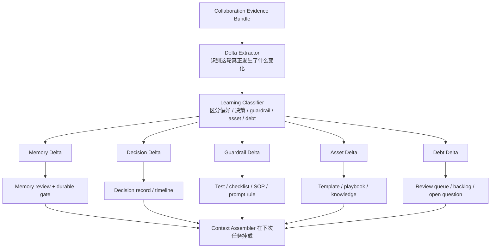
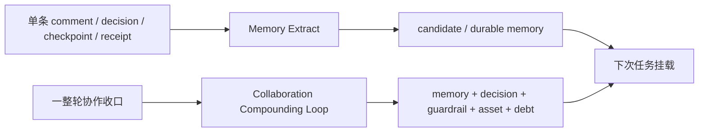

# Cortex 协作复利工程链路

最近更新：2026-04-29

## 这份文档回答什么

这份文档回答的是：

- 在一次 Agent 协作结束之后，Cortex 应该怎样把经验教训、问题、偏好变化、工程审美变化和关键决策，真正编译成下一轮协作的复利资产

它和 `Memory Extract` 有关系，但不是同一个问题。

- `Memory Extract`
  - 回答单条事件如何被提炼成 memory
- `协作复利工程链路`
  - 回答一整个协作周期结束后，系统应该把什么留下来，并让下次协作真的变得更好

## 一句话定义

`协作复利工程链路` 不是“写一段复盘总结”。

它是一条受治理的 after-action compiler：

1. 收集本轮协作证据
2. 提炼出真正发生变化的经验、问题、偏好和决策
3. 把这些变化分流到正确的承载物
4. 让下一轮任务自动继承这些变化

## 1. 为什么这条链路必须存在

如果只有 Memory Extract，而没有协作后的复利链路，会出现 4 个问题：

1. 经验被看见了，但没有真正落到可复用资产里
2. 写作偏好和工程审美变了，但下次协作还是按旧默认值工作
3. 某些问题明明已经反复出现，却没有变成 guardrail、checklist 或测试
4. 决策当时解释清楚了，但一周后又要重新争论一次

所以 Cortex 不能只做 `事件 -> memory`。

它还要做：

- `协作结果 -> 复利资产`

## 2. 这条链路的核心立场

不是所有总结都该进 durable memory。

协作后的产出至少要分成 5 条不同的承载通道：

| 通道 | 承载什么 | 最终落点 |
| --- | --- | --- |
| `Memory Delta` | 稳定偏好、原则、审美、规则变化 | `base_memory / knowledge` |
| `Decision Delta` | 为什么改了方向、为什么选这条路 | `decision record / timeline / knowledge` |
| `Guardrail Delta` | 以后不该再犯的问题、需要机械约束的风险 | `测试 / checklist / SOP / prompt rule` |
| `Asset Delta` | 可复用模板、结构、写作骨架、执行模式 | `knowledge / template / playbook` |
| `Debt Delta` | 还没解决的问题、待验证假设、观察项 | `review queue / backlog / open question` |

这就是关键区别：

- Memory 只是复利资产的一部分
- 复利链路的目标是让系统真的变强
- 所以它必须同时能产出 `memory / rule / test / checklist / debt`

## 3. 什么时候触发这条链路

不是每一句对话都跑一轮大复盘。

推荐触发点：

1. 一个任务完成并通过阶段验收
2. 一轮重要写作或结构调整结束
3. 一个 red / yellow 决策被正式收口
4. 同类纠错连续出现 >= 2 次
5. 用户明确说出新的长期偏好、审美或规则
6. 某次失败、返工、误判值得沉淀为 guardrail

一句话：

- 正常事件走 `Memory Extract`
- 重要收口点走 `协作复利工程链路`

## 4. 输入证据包应该包含什么

每次进入这条链路，先收一份 `Collaboration Evidence Bundle`。

至少包括：

- 当前任务的 `task_brief`
- 本轮关键评论和修改指令
- 关键 `command / run / checkpoint / receipt`
- 被接受或被否定的方案
- 最终交付物 diff
- 返工点、失败点、卡点
- 用户明确表达的偏好变化

如果没有证据包，后面很容易把“当时的感觉”误当成长期规则。

## 5. 复利编译流程

## 6. 这条链路的 6 个步骤

### 6.1 Step 1：收证据，不直接下结论

先收 `evidence bundle`，不要直接写“本次经验是 xxx”。

因为很多所谓经验，其实只是：

- 一次临时 workaround
- 一次特定上下文下的偏好
- 一次没有复现的偶发问题

### 6.2 Step 2：提炼本轮真正的变化

这里提炼的不是“发生了什么”，而是：

- 和上一次相比，什么变了

典型变化包括：

- 写作偏好变化
- 文档结构偏好变化
- 工程审美变化
- 决策口径变化
- 风险边界变化
- 执行方法被验证或被证伪

### 6.3 Step 3：把变化分到正确通道

这里最容易犯错。

一个经验不一定该进入 memory。

例如：

- “以后同步文档默认只保留三块”
  - 更像 `base_memory / preference`
- “这次因为结构太散，导致读评效率低”
  - 更像 `guardrail + pattern`
- “本次选择本地 Markdown first，不做 Notion 主写入”
  - 更像 `decision + rule`
- “这个章节骨架很好，以后类似文档可复用”
  - 更像 `asset / template`
- “Notion Custom Agent 的 discussion reply 仍需观察”
  - 更像 `debt / open_question`

### 6.4 Step 4：分别进入不同承载物

#### Memory Delta

进入条件：

- 会长期影响未来协作方式
- 用户明确表达，或重复出现且证据充分

默认落点：

- `base_memory`
- `knowledge`

#### Decision Delta

进入条件：

- 这次拍板改变了系统路径
- 之后有人很可能会问“为什么这么做”

默认落点：

- `decision record`
- `timeline`
- 必要时进入 `knowledge`

#### Guardrail Delta

进入条件：

- 这次踩坑以后不该再靠记忆避免
- 更适合机械约束而不是口头提醒

默认落点：

- 测试
- checklist
- SOP
- prompt rule
- schema / validation

#### Asset Delta

进入条件：

- 某种写法、结构、工作方式已经可复用

默认落点：

- 模板
- playbook
- 知识条目

#### Debt Delta

进入条件：

- 现在还没收口
- 但它值得被持续追踪

默认落点：

- review queue
- backlog
- `open_question`

### 6.5 Step 5：review，不让弱信号直接污染长期库

推荐规则：

- 用户明确说出的长期偏好
  - 可以直接进入 durable `base_memory`
- 其余内容
  - 先进入 candidate，再由 reviewer-agent + human reviewer 审

尤其下面这些不要直接 durable：

- 只出现一次的写作感受
- 只在单一项目成立的局部 workaround
- 没有证据支撑的“我感觉以后应该这样”
- 仍未收口的问题

### 6.6 Step 6：让下一轮任务真的继承

如果这条链路只产出一份复盘文档，它就还没完成。

真正完成的标准是：

下次任务启动时，系统能自动带上这些变化。

例如：

- 新的写作偏好进入 `base_memory`
- 新的模板进入 `knowledge / asset`
- 新的 guardrail 进入测试或 checklist
- 未收口问题进入 review queue，持续提醒

## 7. 这条链路和 Memory Extract 的关系

两者关系可以这样理解：

区别是：

- `Memory Extract`
  - 以单条事件为单位
- `Compounding Loop`
  - 以整轮协作为单位

所以更准确的说法是：

- `Compounding Loop` 建立在 `Memory Extract` 之上
- 它不是替代 Memory Extract，而是把单条记忆提炼升级成一整套复利机制

## 8. 最小 MVP 应该怎么做

先不要一口气做成复杂系统。

MVP 只做 4 件事：

1. 在每个重要任务收口时生成一份 `Collaboration Evidence Bundle`
2. 自动提议 5 类 Delta：
   - memory
   - decision
   - guardrail
   - asset
   - debt
3. 允许 reviewer 选择每条 Delta 的最终落点
4. 把被批准的变化分别写回：
   - `collaboration-memory.md`
   - 对应机制文档
   - 测试 / checklist / backlog

## 9. 对当前 Cortex 的直接建议

当前最值得先落的不是新数据库，而是先把口径固定：

1. `Memory Extract` 继续负责事件级提炼
2. 新增一条 `Collaboration Compounding Loop`，负责协作级复利编译
3. durable memory 不再承担全部复利职责
4. guardrail、asset、debt 必须有独立出口

## 10. 一句话收口

> Cortex 不该只会“记住发生过什么”。  
> 它还应该会把一次协作真正编译成下一次协作的优势，这就是协作复利工程链路。
