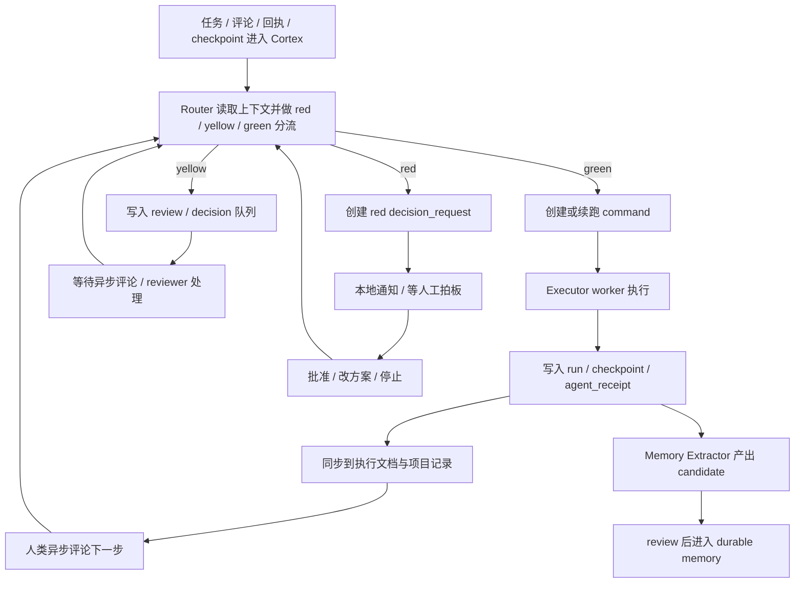
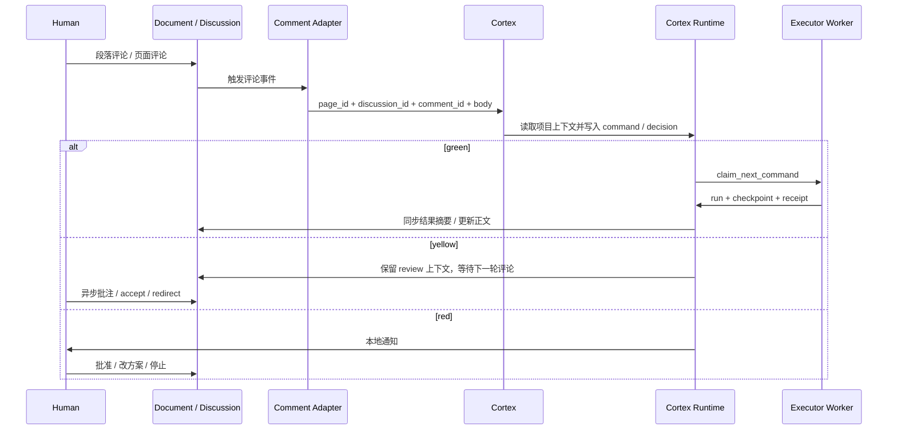
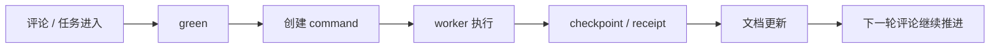
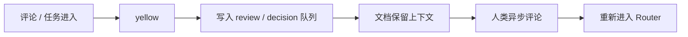
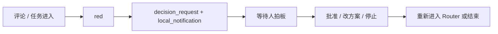
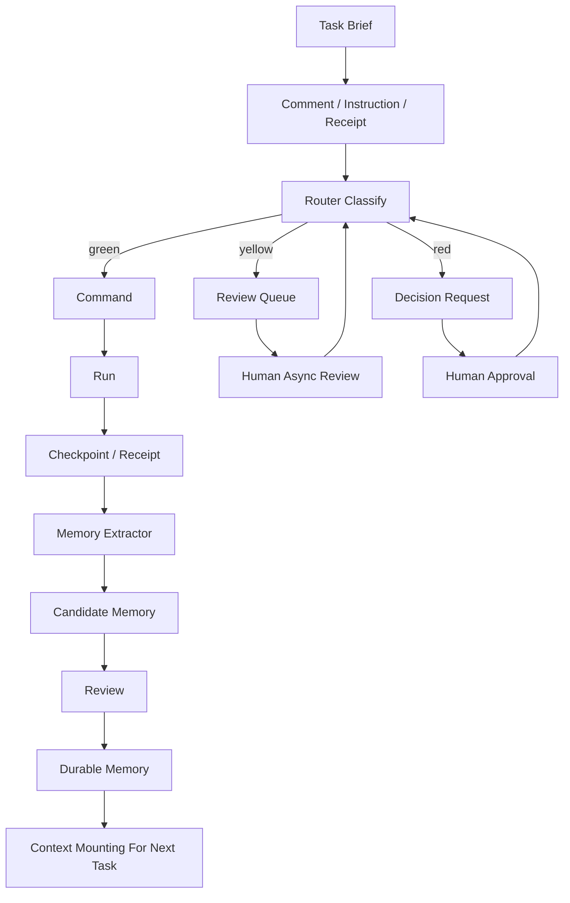

# Cortex 决策链路与文档异步读评工作流

最近更新：2026-04-29

## 这份文档解释什么

这份文档只解释两件事：

- Cortex 里的 `red / yellow / green` 决策链路到底怎么工作
- 文档评论是怎样异步触发下一步任务执行的

它不讨论某个具体前台 UI，也不把 Notion、Obsidian 当成真相源。
真正要固定下来的，是 Cortex 的底层运行原理。

## 一句话版本

Cortex 的工作方式不是“等一个前台总控台来驱动”，而是：

1. 任务、评论、回执、checkpoint 进入 Cortex
2. Router 先做 `green / yellow / red` 分流
3. `green` 直接继续执行，`yellow` 进入文档异步 review，`red` 停下来等人拍板
4. 执行结果再回写成 `checkpoint / receipt / 文档更新 / memory candidate`
5. 下一轮评论继续把系统往前推

## 1. 真相源与协作层边界

| 层级 | 当前角色 | 是否真相源 |
| --- | --- | --- |
| 本地 Markdown | 承载机制文档、SOP、架构说明 | 是 |
| Cortex SQLite / Runtime Objects | 承载 command、decision、run、checkpoint、receipt、memory 的实时状态 | 是 |
| Notion 文档与评论 | 承载异步协作、评论任务、review 上下文 | 不是 |
| Obsidian | 承载知识导航、主题地图、可视化理解 | 不是 |

固定规则：

- 文档正文承载内容工件
- 评论 / discussion 承载任务、反馈、accept / reject、下一步动作
- Notion 和 Obsidian 都是映射层，不允许长出独立主分支

## 2. 整体运行原理

这张图表达的是 Cortex 的核心立场：

- 不是所有事都要先等人批准
- 也不是所有事都可以自动推进到底
- Cortex 先把事件按风险和可逆性分流，再决定继续执行、等待异步 review，还是升级成人工拍板

## 3. 红黄绿灯决策链路

### 3.1 决策链路在判断什么

红黄绿灯判断的不是“这件事重要不重要”，而是：

- 这件事现在能不能直接继续做
- 如果继续做错了，代价能不能低成本收回
- 它是否会污染后续多个模块、规则或正式内容
- 当前是不是已经进入必须让人类拍板的区域

> 核心原则：对 `事件` 分流，不对 `人` 分流。

### 3.2 默认判定规则

| 灯色 | 进入条件 | 系统动作 | 是否停机 |
| --- | --- | --- | --- |
| `green` | 低风险、可逆、局部影响、不涉及正式拍板 | 直接创建或续跑 `command`，进入执行链路 | 否 |
| `yellow` | 不需要立刻停机，但最好异步看一眼；存在不确定性 | 写入 `review / decision` 队列，同步到文档，等待评论 | 否 |
| `red` | 不可逆、高风险、跨模块污染、权限/安全/正式规则变化 | 创建 `decision_request`，触发本地通知，停止继续推进 | 是 |

### 3.3 Green 的含义

`green` 不是“完全没有风险”，而是：

- 即使继续做，错误成本也低
- 做错后能快速修回
- 不会把错误扩散成长期污染

典型动作：

- 沿现有方向继续实现
- 补文档结构说明
- 做一轮 evaluator 检查
- 同步一条 checkpoint

运行结果：

- Router 写入 `command`
- worker `claim -> run -> checkpoint -> receipt`
- 结果进入文档与项目记录
- 如果形成稳定模式，再进入 memory candidate

### 3.4 Yellow 的含义

`yellow` 的本质不是“暂停系统”，而是：

- 当前节点值得异步 review
- 但还没严重到必须立刻打断人
- 在等评论期间，系统仍可继续做别的安全工作
- 它更接近“先绕行，再回看”，而不是“现在就停下来等处理”

典型场景：

- 表达结构可能要调整，但不影响当前低风险收尾
- 某条 candidate memory 值不值得 durable 化，最好异步看一眼
- 某条执行路径可行，但更像“请你读评后再定稿”

运行结果：

- 写入 `review / decision` 队列
- 把上下文同步到文档或评论线程
- 等待下一轮异步评论触发继续执行
- 不触发高优先级中断

`yellow` 后续一般有 3 种去向：

- 随着上下文补全或其他 green 工作完成，降回 `green`
- 继续保留为 `yellow`，等待异步评论或回看
- 当它真正卡住关键路径时，升级为 `red`

### 3.5 Red 的含义

`red` 的本质是：

- 如果不等人拍板就继续做，错误成本会明显放大

典型场景：

- 会覆盖长期默认机制
- 会影响多个后续模块
- 涉及权限、安全、合规、对外发布
- 即将进入不可逆步骤

运行结果：

- 创建 `decision_request`
- 写入 `outbox / local_notification`
- 停止继续推进
- 等人类批准、改方案或直接停止

### 3.6 一条重要总规则

除了 `red` 之外，默认继续推进。

也就是说：

- `green` 直接执行
- `yellow` 进入文档异步 review，但不阻断整个系统
- 只有 `red` 才必须停下来等人

这也是 Cortex 当前的最重要执行口径。

## 4. 文档异步读评如何触发任务执行

### 4.1 文档在 Cortex 里扮演什么角色

文档不是静态汇报页，而是一个异步协作表面。

它分成两层：

- `正文`
  - 承载正在产出的内容、执行记录、阶段性结果
- `评论 / discussion`
  - 承载反馈、任务、accept / reject、下一步指令

所以 Cortex 的问题不是“怎么自动写一份周报”，而是：

- 怎么让一条评论真正变成下一步 command

### 4.2 异步评论触发链路

这里的 `Comment Adapter` 可以是：

- Notion Custom Agent
- 其他文档系统的评论接入器
- 未来别的异步评论入口

但它只是适配层，不是决策内核。

### 4.3 评论进入 Cortex 后会发生什么

一条评论进入后，Cortex 会做 6 件事：

1. `读取上下文`
   - 当前 page / discussion / comment 是什么
   - 这个页面属于哪个项目
   - 之前已经做到哪一步
2. `做 scope guard`
   - 只处理属于当前项目页面树的评论
3. `做 self-loop guard`
   - 避免 agent 自己写的评论再次把自己触发起来
4. `做红黄绿判断`
   - 决定继续执行、进入异步 review，还是升级成人工拍板
5. `写入对象层`
   - 生成 `command`、`decision_request`、`review item` 等对象
6. `决定后续动作`
   - 让 worker 执行
   - 或等待下一轮评论
   - 或触发红灯通知

### 4.4 为什么“评论能继续执行”这件事成立

因为评论在 Cortex 里不会只停留成一段文本。

它会被翻译成结构化动作对象，例如：

- `command`
  - 继续做一件事
- `decision_request`
  - 等待人拍板
- `review item / inbox item`
  - 进入异步读评队列
- `memory review action`
  - 对 candidate memory 做 accept / reject / followup

一旦变成结构化对象，后续的 worker、router、reviewer 才能真正继续接手。

## 5. 决策链路与异步读评是怎样接在一起的

### 5.1 它们不是两套系统

红黄绿灯不是独立模块，文档异步读评也不是另一个平行系统。

真正的关系是：

- `red / yellow / green`
  - 决定一条事件接下来走哪条路
- `文档异步读评`
  - 是其中 `yellow` 和部分 `green` 的主要协作表面

可以把它理解成：

- 决策链路决定方向
- 文档评论承载推进

### 5.2 三条典型路径

#### Green 路径

#### Yellow 路径

#### Red 路径

## 6. 这条链路里的核心对象

| 对象 | 作用 | 什么时候产生 |
| --- | --- | --- |
| `task_brief` | 任务的 `Why / Context / What` | 任务立项或重启时 |
| `command` | 可执行的下一步动作 | `green` 或已获批准后 |
| `decision_request` | 等待人工拍板的结构化请求 | `red`，或某些明确待决策情形 |
| `run` | 一次实际执行尝试 | worker 开始执行时 |
| `checkpoint` | 阶段性结果、进展快照 | 执行中或执行后 |
| `agent_receipt` | agent 对结果的结构化回执 | worker 完成、失败或交接时 |
| `outbox / local_notification` | 红灯提醒的投递通道 | `red` 进入时 |
| `inbox_item / review item` | 等待异步 review 的队列项 | `yellow` 或 memory review 时 |
| `memory_item` | 提炼后的记忆对象 | checkpoint / decision / receipt 被 extractor 命中时 |

这套对象模型的意义在于：

- 评论不会直接修改长期状态
- 它先进入 Cortex 对象层
- 然后再由对象驱动执行、回执、文档更新和 memory 沉淀

## 6.1 task、decision point、run 不是一层东西

这里最容易混淆的，是下面 3 个单位：

### `task`

- 一个具体任务
- 是用户在顶层工作台上真正要管理的单位

### `decision point / thread`

- 任务内部某一个具体判断点
- 可能是 green / yellow / red
- 一个 task 里可以有多个 decision point

### `run`

- 某个 agent 对某条 command 的一次实际执行尝试
- 它解决的是“agent 到底有没有在跑、跑到哪了”

正确关系是：

- `task` 决定首页怎么分诊
- `decision point` 决定任务内部为什么会绕行、升级或继续
- `run` 决定执行脉搏是否正常

所以 Cortex 不应该把首页主单位改成 `run`。

因为如果这样做，会把用户重新拖回“按 agent 会话轮询”的旧世界。

但 Cortex 必须额外提供一个 `run` 观察层，用来解决另一个真实问题：

- 某个 agent 是否跑到 red 后停住了
- 某个 run 是否长时间没有新的 checkpoint / receipt
- 当前到底是谁在推进，谁已经空转或挂起

## 7. 从任务到记忆的完整生命周期

关键理解：

- 任务推进和 memory 沉淀是同一条大链路的前后两段
- 先有执行，后有 checkpoint，之后才有 memory candidate
- durable memory 不来自“随手总结”，而来自已发生事件的可审阅提炼

## 8. 当前固定执行口径

1. 非 `red` 事项默认继续推进，不等人逐条确认。
2. `yellow` 事项进入文档异步 review，但不把整个系统打停。
3. `red` 事项必须在不可逆步骤前停住，并触发本地通知。
4. 评论写在文档 discussion 里，不写进正文。
5. 正文承载结果，评论承载反馈和下一步动作。
6. 本地 Markdown 和 Cortex 对象层是主真相源。
7. Notion 与 Obsidian 只做镜像、导航、review 和理解，不单独发散。
8. 当前阶段不要求单独前台 workspace 才能跑闭环。

## 9. 跟 Memory Extract 的关系

这套链路和 Memory Extract 是直接相连的：

- `comment / decision / checkpoint / receipt`
  - 先推动执行闭环
- 其中稳定、可复用、可追溯的部分
  - 再被 Extractor 提炼成 `candidate memory`
- 经过 review 后
  - 进入 `durable memory`
- 下一次任务启动时
  - 再由 Context Assembler 挂载回去

所以 Cortex 不是“先做记忆，再做执行”，而是：

- 执行产生事件
- 事件沉淀记忆
- 记忆反过来增强下一轮执行

## 10. 一句话收口

> Cortex 的底层原理可以压缩成一句话：  
> `评论把事件送进 Cortex，Router 用红黄绿灯决定走法，worker 推进执行，文档承载异步读评，memory 负责把稳定经验留下来。`

## 11. 2026-05-11 最小闭环 checkpoint

本轮后端闭环已经补上 Notion 结构化评论命令：

- 已有能力：Notion Custom Agent webhook、page scope guard、self-loop guard、普通 comment -> command/triage、decision request、memory candidate/review API、checkpoint -> memory candidate 投影都已存在。
- 新增能力：`POST /webhook/notion-custom-agent` 会优先解析显式 `approve / reject / request_changes / block / continue`，不再只能靠纯自然语言分类。
- 新增分发：`approve decision` 更新 decision 并触发 memory candidate；`approve memory` 将候选记忆推进到 durable；无 target 的 `block` 直接创建红灯 decision request；`continue` 继续进入 command 队列。
- 仍然保持：前台 UI 未改，legacy `/webhook/notion-comment` 保留，Notion Custom Agent 是主路径。

剩余缺口：

- 红灯：真实 Notion 侧 Custom Agent trigger / MCP connection 仍需要在 Notion UI 中挂接并实测。
- 黄灯：当前 memory durable 后会进入本地全局 memory hub；项目级 Notion memory 页面仍依赖既有 `memory:compile` / `memory:notion-sync` 镜像链路，不在 webhook 内实时写 Notion 正文。
- 黄灯：executor claim 后的真实 receipt/checkpoint 回写仍取决于外部 agent worker 是否在线。
