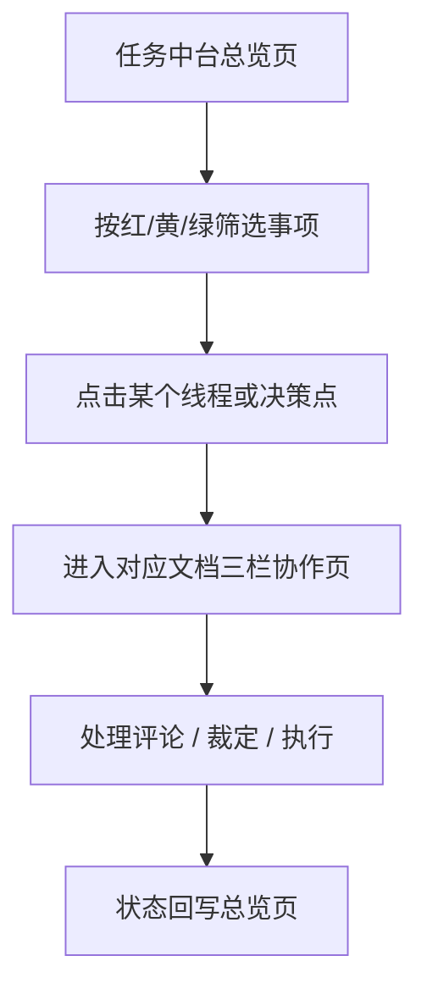
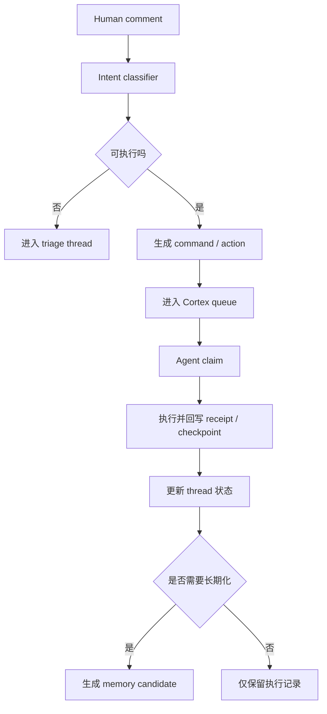

# Cortex 文档工作台 P0 方案

最近更新：2026-05-09

## 最新进展

这一版已经从“只读执行现场”推进到“最小交互工作台”：

- `/workspace/docs/:documentId` 中间文档区可以直接保存回 Cortex 本地 Markdown
- `/workspace` 首页任务卡已经直接暴露 `当前节点 / 执行链 / 最近回执 / 回执摘要`，人不必先点进线程或翻日志才能知道 agent 有没有继续跑
- 当线程进入等待拍板或停滞时，首页卡片还会补 `卡点原因 / 推荐动作`，把“为什么停住、建议怎么处理”提前暴露在总览层
- 首页 `current node` 已补齐 `Run / 决策 / 任务简报` fallback，当前真实 `PRJ-cortex` 进行中任务里已经没有“尚未形成可见执行节点”的占位卡
- 首页 `任务简报` 节点已经汉化成 `草稿中 / 已对齐 / 执行中 / 已完成`，避免把内部工作流状态直接暴露给人
- attention 视图还会透明合并同线程相近 brief 卡，并在卡片上显示 `同线程任务 / 已合并相近卡`，减少总览噪音但不丢失 thread 级真实任务数
- thread 视图里的原始子任务卡则反向增强为“可区分明细”，会直接展示 `任务标识 / 当前节点 / 最近更新 / 执行链`
- 多子任务线程的右栏 `执行摘要` 也会同步增强，直接给出 `当前活跃子任务 / 子任务分布`
- 左侧线程目录和线程头会前置 `当前聚焦`，让人还没展开右栏细节时，也能先看到每条线程当前盯的是哪条子任务
- `任务流转` 卡片会优先跟随 `当前活跃子任务`；如果活跃子任务尚未挂上评论链，也会显式告诉人现在看到的是线程最近评论链
- `评论线程` 卡片会补 `关联子任务 / 与当前聚焦关系`，线程头也会补 `队列概览`，让 comment、task、thread 三层状态在同一屏里就能对齐
- `评论线程` 卡片会优先把当前聚焦子任务相关 comment 排到前面，并允许一键跳到对应子任务卡，进一步缩短“看到评论 -> 定位任务 -> 继续执行”的路径
- 当前真实 `PRJ-cortex` 的首页分布也更接近真实执行语义：`任务总数 = 21（raw 22）`、`系统处理中 = 8`、`最近完成 = 13`
- `/workspace/threads/:threadId` 右栏可以直接处理红灯 / 黄灯决策
- `/workspace/threads/:threadId` 右栏现在还能直接发起新的协作输入，默认落成执行命令，也可以原地升级成黄灯 / 红灯决策请求
- triage 评论卡片现在支持“补充后继续”，可以先补一条明确指令，再把原本模糊的评论重新接回执行链路
- 右栏新增事件时间线与“任务流转”卡片，能解释最近 comment 如何进入 command / run / receipt / checkpoint，并显示链路计数与原始评论入口
- `任务流转` 与 `评论线程` 卡片现在会直接展示最新回执、回执摘要、最新 checkpoint 和 checkpoint 摘要，线程是否真的推进不再需要靠人工比对 event list
- 右栏新增“执行摘要”卡片，能直接告诉人当前线程是自动推进、黄灯绕行还是等待拍板，并显示当前节点与负责人
- 可执行 comment 卡片本身已经能原地派发 `continue / improve / retry / stop`，不必只依赖顶部工作流卡片
- 执行摘要还会补“活跃度”语义，让人不用自己换算时间戳，就能判断线程是否刚刚更新或可能停滞
- 红黄灯决策卡片已经展开“为什么现在处理 / 需要你做什么 / 影响范围 / 证据 / 原始上下文”
- 核心记录已经带 `thread_key / thread_label` 持久化字段，且历史空白 thread identity 会在启动时自动回填
- 只有决策、还没挂到 brief 的线程，也会保留成独立线程卡片，不再被误并到别的任务上

当前还没做的是：

- 真正的富文本/块编辑器内核
- 原生评论线程（reply / resolve / 再派发）
- 更激进的历史 thread cleanup / merge 治理

## 1. 先说结论

我们不建议把 `comment` 和 `task state` 全部从零手搓。

更合理的做法是：

- `编辑器内核` 复用成熟开源能力
- `评论锚点 / 评论线程基础能力` 尽量复用成熟开源能力
- `任务状态语义 / 评论转执行 / 红黄绿灯 / Memory 信号` 由 Cortex 自己实现

一句话：

`不是纯自建，而是“成熟编辑器 + Cortex 任务语义层”的组合。`

---

## 2. 有没有现成的 skill 可以直接用

结论是：`没有一个可以直接拿来当成 Cortex 文档工作台的现成 skill`。

原因不是没有轮子，而是这些能力分散在两类东西里：

### 2.1 有的是 Codex skill

这些 skill 更像“工作助手”，不是前端产品模块。

比如当前环境里有：

- `obsidian-markdown`
- `obsidian-cli`
- `notion-*`
- `browser-use`

它们适合：

- 读写文档
- 同步资料
- 浏览器联调
- 生成规划文档

但它们不提供：

- 一个可直接嵌入你前端的 Notion 式编辑器
- 划词评论线程
- 评论状态流转
- 评论到任务执行的领域逻辑

### 2.2 真正可复用的是开源前端能力，不是 skill

这部分才是我们应该借的轮子。

- `Plate`：有评论插件，适合 React 内深度定制
- `BlockNote`：自带 comments / threads，更接近“开箱即用”的文档编辑体验
- `Tiptap Comments`：功能强，但是商业功能，且依赖其文档服务
- `Recogito Text Annotator`：适合做文本批注，不适合直接做完整文档工作台

所以这题的答案不是“找一个 skill 全包”，而是：

`选一个成熟编辑器内核，再把 Cortex 自己的评论语义和任务状态挂上去。`

---

## 3. 哪些层可以复用，哪些层必须自己做

## 3.1 可以复用的层

这部分不值得自己从零实现。

### A. 编辑器内核

负责：

- block / paragraph / heading / list / quote 等基础文档能力
- 光标、选区、撤销重做
- block 级渲染和快捷输入

推荐：

- `Plate`

备选：

- `BlockNote`

### B. 评论锚点能力

负责：

- 选中文本后创建评论
- 把评论挂到一段文本或 block 上
- 评论高亮和定位

推荐做法：

- 优先复用编辑器已有 comment/annotation 机制
- 不自己重造 selection anchoring

### C. 评论线程基础 UI

负责：

- thread
- reply
- resolve
- 定位到原文

这层可以基于现成 comment plugin 或 demo 扩展，不需要白手起家。

## 3.2 必须由 Cortex 自己实现的层

这部分才是 Cortex 的 know-how。

### A. 评论语义理解

不是所有评论都等于“继续执行”。

我们需要判断：

- 这是继续做
- 这是修改后再做
- 这是打回重做
- 这是提问，不可直接执行
- 这是纯反馈，先进入 triage
- 这是越权/危险指令，应直接拒绝

这层目前已经有基础：

- `src/comment-intent.js`

### B. 任务状态层

Notion 的评论线程本身没有 Cortex 需要的任务状态语义。

我们自己的线程必须能表达：

- 当前是不是可执行
- 是否已经进入 command queue
- 是否已被 agent claim
- 是否正在执行
- 是否在等人拍板
- 是否已完成或被拒绝

### C. 人类裁定语义

你已经定下来的这套状态，不属于通用评论系统，而属于 Cortex 自己的协作协议：

- `允许`
- `允许，以后无需询问`
- `拒绝，并给出指导意见`

这层不仅影响当前 thread，还会影响：

- 是否继续生成 command
- 是否升级为 memory candidate
- 是否沉淀成 Base Memory / Knowledge

### D. 评论到执行的流转

这层要接 Cortex 现有后端：

- `commands`
- `decisions`
- `checkpoints`
- `receipts`
- `memory_items`

通用评论库不会帮我们做这件事。

---

## 4. 推荐技术选择

## 4.1 当前推荐

`Plate + Cortex existing backend + 自定义 comment/thread/task-state layer`

原因：

- 适合 React 场景
- 评论插件是开放可控的
- 不会被商业协作服务绑死
- 比起完整 fork 一个大产品，改造成本更低
- 更适合把 Cortex 的 command / decision / receipt / memory 接进去

## 4.2 为什么现在不优先选 Tiptap Comments

不是它不强，而是它现在不适合我们这个 P0。

主要问题：

- 评论功能是商业能力
- 依赖它自己的文档服务能力
- 会把我们的 P0 绑进额外基础设施和付费链路

这和 Cortex 当前“本地 Markdown + SQLite 为真相源”的方向不一致。

## 4.3 为什么 BlockNote 是备选，不是首选

BlockNote 的 comments 做得很像现成成品。

但当前阶段它更偏：

- 实时协作
- threadStore
- 协同 provider

而我们的 P0 重点还不是多人实时协作，而是：

- 单人 + agent 的异步协作
- 评论语义转执行
- 任务状态可视化

所以它可以当备选 spike，但不是首选。

---

## 5. P0 工作台结构

这部分按你的判断收敛，不再发散成复杂前台系统。

P0 不是只有一个页面，而是两个互补视图：

- `任务中台总览页`
- `单文档三栏协作页`

关系是：

- 总览页负责看全局风险、线程状态、决策堆积
- 三栏页负责进入具体文档做编辑、评论和执行协作

也就是说：

`先看全局，再钻具体文档。`

## 5.1 任务中台总览页

这页不需要从零做。

当前已有的 `/dashboard` 已经具备基础能力，可以直接升级成正式的任务中台。

它应该回答 4 个问题：

- 现在一共有多少红灯、黄灯、绿灯事项
- 哪些线程正在执行，哪些在线等人拍板
- 哪些决策点最值得优先处理
- 哪些文档/项目当前最拥堵

P0 建议的核心统计卡片：

- `红灯线程`
- `黄灯线程`
- `绿灯线程`
- `红灯决策`
- `黄灯决策`
- `绿灯决策`
- `执行中线程`
- `等待人工线程`

如果 P0 想更克制，也可以先收成 6 个：

- `红灯事项`
- `黄灯事项`
- `绿灯事项`
- `执行中`
- `等待人工`
- `最近完成`

这里的“事项”可以是 thread，也可以是 decision。

关键不是对象类型，而是让人一眼看到：

- 风险有多少
- 堵点在哪
- 哪些可以不用管
- 哪些必须立刻处理

P0 建议再补 3 个列表区：

- `需要立即拍板`
- `等待 review`
- `最近完成`

## 5.2 单文档三栏协作页

进入具体文档后，再进入三栏形态。

P0 只做三栏：

## 5.3 左侧：文档目录

承载：

- 项目文档树
- 当前文档列表
- 执行文档 / Memory 文档 / 决策文档等入口

P0 最小能力：

- 展示项目下文档目录
- 切换当前文档
- 新建文档
- 标识文档是否有未处理线程

## 5.4 中间：编辑器

承载：

- 文档正文编辑
- block 级结构
- 文本选区
- 内联评论锚点

P0 最小能力：

- 基础 block 编辑
- Markdown / JSON 双向保存
- 选中文本创建评论
- 点击评论高亮回跳正文

## 5.5 右侧：评论线程

承载：

- 当前文档的 thread 列表
- thread 的执行状态
- thread 的人类裁定结果
- agent receipt / checkpoint 摘要

这块虽然参照 Notion，但不是照搬 Notion。

Notion 的右栏主要是“讨论”。

Cortex 的右栏必须是：

`讨论 + 执行状态 + 人类裁定 + 下一步动作`

---

## 5.6 总览页与三栏页的关系

建议把它设计成一条非常自然的路径：

所以“任务中台”不是独立于文档协作之外的第二套系统。

它更像：

- `总览层`
- `分诊层`

而三栏文档页是：

- `执行层`
- `协作层`

这两个视图配合起来，产品结构会比“只有三栏页”更完整。

---

## 6. 右侧评论线程的状态设计

这里建议把“线程状态”拆成两层，不要混成一个字段。

## 6.1 第一层：执行状态

用于描述这条 thread 当前在工作流里的位置。

建议 P0 先收这 6 个：

- `pending`
- `triaged`
- `ready`
- `running`
- `waiting_human`
- `done`

补充状态：

- `rejected`

含义：

- `pending`：刚创建，还没判定
- `triaged`：已判定为反馈/问题/待澄清，暂不执行
- `ready`：允许进入命令队列
- `running`：已有 agent 认领并执行
- `waiting_human`：升级到人类裁定
- `done`：任务执行完成
- `rejected`：被显式拒绝，不继续执行

## 6.2 第二层：人类裁定结果

这层才是你刚刚强调的重点。

建议 P0 明确成 3 个主动作：

- `allow_once`
- `allow_as_default`
- `reject_with_guidance`

对应展示文案：

- `允许`
- `允许，以后无需询问`
- `拒绝，并给出指导意见`

它们的区别不是文案，而是系统行为不同：

### `allow_once`

- 允许这次继续执行
- 不自动沉淀成稳定 Memory
- 适合单次拍板

### `allow_as_default`

- 允许继续执行
- 同时生成 memory candidate
- 倾向沉淀为 `preference` 或 `rule`
- 后续类似场景默认不再重复询问

### `reject_with_guidance`

- 当前路径停止
- 记录拒绝原因和指导意见
- 可触发 `improve` / `retry` / `clarify`
- 必要时也可生成 incident / preference / rule 类 memory signal

---

## 7. 评论线程与任务状态的最小数据模型

P0 不需要一开始就过度复杂，但字段要够支撑后续演进。

建议最小对象如下：

### `document_threads`

- `thread_id`
- `project_id`
- `document_id`
- `anchor_type`
- `anchor_payload`
- `status`
- `resolution`
- `intent`
- `owner_agent`
- `command_id`
- `decision_id`
- `checkpoint_id`
- `created_by`
- `created_at`
- `updated_at`

### `thread_comments`

- `comment_id`
- `thread_id`
- `body`
- `author_type`
- `author_id`
- `intent`
- `execution_policy`
- `self_authored`
- `created_at`

### `thread_receipts`

- `receipt_id`
- `thread_id`
- `command_id`
- `agent_name`
- `summary`
- `status`
- `created_at`

关键点：

- `thread` 是协作对象
- `comment` 是讨论对象
- `command / decision / checkpoint / receipt` 是执行对象

三者不能混成一个表。

---

## 8. 评论如何转成下一步执行

这部分不再靠“看起来像命令”这种模糊规则，而是进入明确流转。

P0 中直接复用现有基础：

- `src/comment-intent.js`

但需要把它接到真正的 thread UI 上。

也就是说：

- 不是只有后端识别
- 右栏线程里也要显式展示这条评论被识别成什么
- 用户要能看到系统为什么执行 / 为什么没执行

---

## 9. 和 Memory 的关系

右侧评论线程不只是“讨论区”，它还是 Memory Extract 的触发点。

特别是下面两类动作：

- `allow_as_default`
- `reject_with_guidance`

它们天然带有稳定协作偏好和决策信号。

所以建议：

- `allow_once`：默认不沉淀 durable memory
- `allow_as_default`：自动生成 candidate memory，等待 review
- `reject_with_guidance`：生成 candidate memory 或 incident signal，视内容而定

这样评论线程就不只是执行面板，也会成为 Memory Engine 的高价值输入源。

---

## 10. P0 执行计划

## Phase 0：技术确认

目标：

- 快速验证评论能力到底怎么借最划算

动作：

- 用 `Plate` 做一个最小编辑器 spike
- 跑通“选区 -> 创建 thread -> 右栏展示 -> 点击回跳正文”
- 验证现有 `comment-intent` 能否直接挂进 thread action

产出：

- 最终技术选型结论
- 最小数据结构草图

## Phase 1：文档工作台数据层

目标：

- 让 document / thread / comment / receipt 有独立对象模型

动作：

- 新增 `documents`
- 新增 `document_threads`
- 新增 `thread_comments`
- 新增 `thread_receipts`
- 与现有 `commands / decisions / checkpoints / memory_items` 建关联

验收：

- 一个 thread 能完整关联到 command / receipt / checkpoint

## Phase 2：三栏前端工作台

目标：

- 先把三栏形态稳定跑起来

动作：

- 左栏文档目录
- 中栏编辑器
- 右栏评论线程
- 支持 thread 定位、筛选、状态展示

验收：

- 可以创建文档
- 可以划词评论
- 可以在右栏看到 thread
- 可以从右栏回跳到正文锚点

## Phase 3：评论状态与裁定动作

目标：

- 把右栏从“讨论区”升级成“可执行协作面板”

动作：

- 支持 `allow_once`
- 支持 `allow_as_default`
- 支持 `reject_with_guidance`
- 展示执行状态 `pending / triaged / ready / running / waiting_human / done / rejected`

验收：

- 每个 thread 都能看见“当前状态 + 裁定动作 + 下一步”

## Phase 4：评论转执行

目标：

- 真正跑通“评论 -> 任务 -> agent -> receipt -> 回写”

动作：

- 接通 `comment-intent`
- 可执行评论进入 `command queue`
- 非可执行评论进入 `triage`
- receipt / checkpoint 自动回写 thread

验收：

- 一条线程可以从评论一路跑到执行完成

## Phase 5：Memory 联动

目标：

- 把高价值裁定动作接入 Memory Engine

动作：

- `allow_as_default` -> candidate memory
- `reject_with_guidance` -> candidate memory / incident signal
- thread 页面展示“是否已沉淀 memory”

验收：

- 评论线程可以成为 durable memory 的标准入口之一

---

## 11. P0 非目标

这轮先明确不做：

- 不追求完整 Notion 替代
- 不做多人实时协同编辑
- 不做公开分享和复杂权限系统
- 不做富媒体块的全量兼容
- 不做开放式 assistant 聊天区

P0 的目标非常明确：

`先把“文档编辑 + 评论线程 + 任务状态 + 评论转执行”这条协作主链路跑通。`

---

## 12. 当前建议

如果现在就进入落地阶段，我建议直接按下面路径走：

1. 锁定 `Plate` 作为编辑器内核
2. 不自己重造评论锚点，先复用 comment plugin 能力
3. 右栏 thread UI 自己做，因为 Cortex 要挂任务状态和裁定动作
4. 线程状态拆成 `执行状态` + `人类裁定结果` 两层
5. 先只支持三种裁定动作：
   - `允许`
   - `允许，以后无需询问`
   - `拒绝，并给出指导意见`
6. 先把 thread 接到现有 `comment-intent -> command -> receipt -> memory` 后端链路

这条路的好处是：

- 不会陷入从零造编辑器
- 不会被 Notion / Obsidian 的产品边界卡住
- 不会被商业评论服务绑架
- 可以最大化复用 Cortex 现有执行内核

---

## 13. 参考资料

- [Plate Comments 文档](https://platejs.org/docs/comment)
- [Plate Comments 示例文档](https://next.platejs.org/docs/comments)
- [BlockNote Comments 文档](https://www.blocknotejs.org/docs/collaboration/comments)
- [BlockNote Comments 示例](https://www.blocknotejs.org/examples/collaboration/comments)
- [Tiptap Comments 概览](https://tiptap.dev/docs/comments/getting-started/overview)
- [Tiptap Comments 扩展文档](https://tiptap.dev/docs/editor/extensions/functionality/comments)
- [Recogito Text Annotator](https://github.com/recogito/text-annotator-js)

---

## 14. OpenAgents + gstack 规划视角

可以用，而且适合拿来做“规划参考系”。

但不建议直接把 Cortex 改造成它们的翻版。

更合适的用法是：

- `OpenAgents` 负责启发协作拓扑
- `gstack` 负责启发执行方法论
- `Cortex` 保留自己的本地真相源、决策分级和 Memory 治理

## 14.1 从 OpenAgents 借什么

OpenAgents 更像：

- 持续在线的 agent workspace
- 共享文档 / 共享资源 / 共享上下文
- 事件驱动的协作网络

它最值得借的是 3 个视角：

### A. workspace 不是聊天窗口，而是协作空间

这和 Cortex 现在要做的方向高度一致。

对应到 Cortex：

- `任务中台总览页` = workspace 总览层
- `三栏文档页` = workspace 协作层
- `thread / decision / receipt / memory` = workspace 内的核心对象

### B. 一切协作对象都应该能被持续追踪

OpenAgents 强调持久化的 network / workspace / document / event。

对应到 Cortex：

- 每个 thread 不只是评论
- 它还要和 command / decision / checkpoint / receipt 绑定
- 状态变化要可追踪、可回放、可审计

### C. 用事件流来连接协作动作

这个思路很适合 Cortex 后端。

对应到 Cortex：

- comment created
- intent classified
- command enqueued
- agent claimed
- receipt submitted
- thread resolved
- memory projected

这些都可以逐步统一成事件流视角。

## 14.2 从 gstack 借什么

gstack 更像：

- 一套面向 AI 开发团队的角色化工作方式
- 一套明确的阶段流程
- 一套并行 sprint 的执行纪律

它最值得借的是 3 个视角：

### A. 角色分工要显式

gstack 把 CEO、Designer、Reviewer、QA、Release 等角色拆得很清楚。

对应到 Cortex：

- Router
- Executor
- Reviewer
- Curator
- Context Assembler
- Human approver

我们不一定要用它的角色名，但可以借它“角色显式化”的方法。

### B. 流程要阶段化，不要所有 agent 混着干

gstack 的价值不只是多角色，而是：

- think
- plan
- build
- review
- test
- ship

对应到 Cortex：

- task intake
- decision split
- document execution
- review/comment
- receipt/checkpoint
- memory extraction

这会帮助我们把“评论线程”从普通讨论区，变成有阶段感的执行流。

### C. 并行推进需要纪律，而不是更多 agent

这一点和 Cortex 很契合。

不是 agent 越多越强，而是：

- 哪些能自己跑
- 哪些该绕行
- 哪些必须升级人工

这正是红黄绿灯机制要解决的问题。

## 14.3 哪些不能直接照搬

### A. 不能把 OpenAgents 的 hosted workspace 当成 Cortex 真相源

Cortex 已经定了：

- 本地 Markdown
- 本地 SQLite

这才是单一真相源。

所以 OpenAgents 更适合当“结构参考”，不适合直接替代我们的底座。

### B. 不能把 gstack 当成前端产品方案

gstack 的强项是编码工作流，不是文档协作前端。

它可以帮助我们定义：

- 角色
- 节奏
- 审查顺序

但不能直接解决：

- 文档目录
- 编辑器
- 划词评论
- 线程状态 UI

### C. 不能为了像它们而牺牲 Cortex 的主路径

Cortex 的主路径已经很明确：

- Memory 跟随人，不跟随会话
- 红黄绿灯决定打不打断人
- 文档评论是异步执行入口
- durable memory 需要治理和裁定

这些是我们的核心，不应该被外部框架改写。

## 14.4 对 Cortex 最合适的组合方式

如果把它们合在一起，最合理的说法是：

`Cortex = OpenAgents 式协作空间视角 + gstack 式角色化执行方法 + 本地真相源 + 红黄绿灯决策 + Memory 治理`

落到产品上就是：

- 用 `OpenAgents` 的思路定义 workspace / thread / event / shared context
- 用 `gstack` 的思路定义 role / stage / review discipline
- 用 `Cortex` 自己的机制定义 decision / memory / async document workflow

这条路线是兼容的，而且比单独借其中一套更适合你现在的项目。
