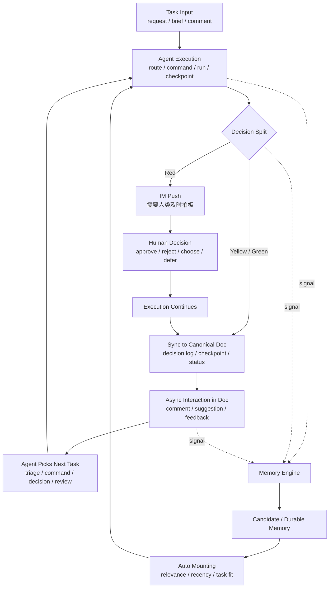
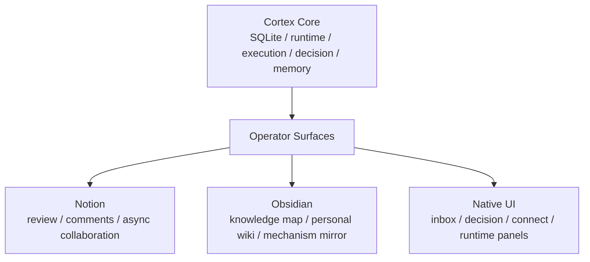

# Cortex vNext MVP Shape

最近更新：2026-04-16

## 1. 先说结论

Cortex 的 P0 / MVP，不应该被定义成“一个漂亮的前台页面”。

它真正要落地的是：

`一个能稳定承接多 agent 执行、升级人类决策、处理异步 review、沉淀 durable memory 的协作控制中枢`

所以更准确地说：

- **P0 先交付 backend-first 的可运行系统**
- **P1 / P2 再把它逐步产品化成更清晰的前台控制面板**

一句话：

`MVP 先要把闭环跑通，前台界面不是前置条件，但会是后续重要增强。`

---

## 2. MVP 要回答的 3 个问题

这份文档只回答 3 个问题：

1. 什么是 Cortex 的最小 MVP 闭环
2. 什么属于 P0 之后持续优化、让它更完善的部分
3. 最终落地的产品形态，到底是后台系统、前台界面，还是两者结合

---

## 3. 最小 MVP 闭环

## 3.1 一句话定义

最小 MVP 闭环不是“所有功能都做完”。

而是下面这条用户旅程能稳定重复跑通：

`任务进入 -> agent 执行 -> 红黄绿决策分流 -> 文档异步交互 -> 各节点内容沉淀到 Memory -> 后续任务按相关性自动挂载`

如果这条链路不能稳定重复发生，Cortex 就还不能算真正落地。

## 3.2 最小闭环图

## 3.3 用户旅程拆解

### 1. 任务执行

- 新任务进入 Cortex
- Cortex 把任务路由给对应 agent
- agent 开始执行，产生 command、run、checkpoint、receipt 等运行时对象

### 2. 决策分流

- `red`
  - 需要及时升级给人类
  - 通过 IM push 或本地高优先级通知触发拍板
- `yellow / green`
  - 不走高优先级打断
  - 直接同步到 canonical doc，进入异步协作面

这里最关键的不是“所有决策都同步处理”。

而是按风险分流：

- 红灯走强提醒
- 黄绿灯走文档沉淀和异步回流

### 3. 异步交互

- 人类主要通过文档评论继续给出反馈
- 评论可以被转成下一条 command、decision、review 或 suggestion action
- agent 再次接球后继续推进执行

### 4. 内容沉淀

不是只在任务结束时才沉淀 memory。

而是每个关键节点都可能发出 memory signal：

- 执行结果
- 决策结论
- 文档评论
- suggestion accept / reject
- checkpoint
- incident / exception

这些信号进入 Memory Engine 后，再经过 candidate、review、durable 的治理过程。

### 5. 自动化挂载

后续任务开始前，不是把所有 memory 粗暴全挂。

而是由 Context Assembler 按下面这些维度决定挂载什么：

- task relevance
- project scope
- decision dependency
- recency
- confidence
- freshness

最终输出的是一份和当前任务相关的 context packet，而不是 memory 全量转储。

## 3.4 MVP 最小可交付能力

P0 只要保证下面 7 件事成立，就已经构成一个真实可用的协作系统。

### 1. 统一执行中枢

- 所有任务都进入同一个 Cortex project / runtime
- `commands / runs / checkpoints / receipts` 能形成真实执行链路

### 2. 决策可分流

- `green` 可以直接推进
- `yellow / green` 会沉淀到文档
- `red` 会被升级到 IM / 高优先级通知
- 人类能明确看到红灯到底要拍什么板

### 3. 异步文档交互可闭环

- 评论、反馈、suggestion 不再只是文字
- 它们可以转成 command、decision 或 review 动作
- 结果能回到原 discussion 或 canonical doc

### 4. 各节点内容都能进入 Memory 沉淀

- 执行、决策、评论、review、异常都能发出 memory signal
- candidate memory 可以被提炼出来
- durable memory 必须经过人类最终裁定

### 5. 后续任务可以自动挂载正确上下文

- 挂载不是全量继承
- 系统会按相关性、时效性、置信度做 context selection
- 后续任务默认继承的是“被挑选过的 durable context”

### 6. agent 可以被接入

- 至少有一条真实可复制的 agent onboarding 金路径
- 接入后能跑完整的 `command -> execute -> receipt -> reply`

### 7. 系统能长期运行

- 不是手动起起来就算
- 至少要有常驻、恢复、健康检查、失败定位

## 3.5 MVP 验收口径

MVP 是否成立，不看页面有多漂亮。

而看下面这些问题能不能全部回答“可以”：

- 能不能稳定接收任务并路由给正确 agent
- 红灯能不能稳定通过 IM / 高优先级通知升级给人类
- 黄灯和绿灯能不能稳定同步进文档并进入异步交互
- 人类评论后，agent 能不能接到下一步任务并继续推进
- 各节点内容能不能持续沉淀到 memory
- 新任务开始时，系统能不能按相关性自动挂载正确上下文
- 系统掉了以后，能不能被发现、恢复、排障

只要这 7 个问题都成立，Cortex 就已经不是概念系统，而是 MVP 可落地系统。

---

## 4. P0 不需要一次做完的部分

P0 之后当然还有很多重要东西。

但它们属于“持续优化”和“让系统更完美”，不应该卡住 MVP 的成立。

## 4.1 这些属于持续优化

### 体验优化

- 更自然语言化的 comment 理解
- 更流畅的 suggestion review 体验
- 更清晰的队列排序、过滤、聚合
- 更漂亮的 dashboard 和 status board

### 治理优化

- 更强的 freshness / revalidation 自动化
- curator 的自动 dedupe / merge 建议
- conflict detection 的质量提升
- 更完整的 audit trail 和变更日志

### 检索优化

- metadata filter
- BM25 + vector 混合检索
- graph relation expansion
- 更强的 context assembly 策略

### 协作优化

- 更细粒度的 role / capability / permission
- 更成熟的多工程接入 SOP
- 更强的 worker 调度、失败重试、吞吐治理

### 前台优化

- Native Inbox 页面
- Native Decision Hub 页面
- Native Memory 页面
- Native Connect 页面
- Native Document Review 页面

## 4.2 这些不该挡住 MVP

下面这些东西都可以做，但不应该成为“系统能不能上线”的前置条件：

- 完整 Native UI
- 高级权限矩阵
- 全自动 memory curator
- 很复杂的 planner / evaluator 编排
- 很复杂的多工作区可视化
- 追求一次性把 Notion / Obsidian / Native 全部统一完美

---

## 5. 最终产品到底是什么

这个问题要分两个层次回答。

## 5.1 从系统本质上看

Cortex 本质上是一个：

`backend-first 的协作控制中枢 / harness runtime`

它的职责是：

- 持有真实执行状态
- 管理决策升级
- 管理 review 队列
- 管理 memory 准入和挂载
- 管理 agent 接入与运行态

所以从本体上说，Cortex 不是“一个前端产品壳子”。

它先是一个 runtime system。

## 5.2 从用户使用上看

但它也不应该永远只是后台。

因为只靠文档、评论、CLI 和日志，随着复杂度增加一定会失控。

所以更合理的产品定义是：

`Cortex = 控制中枢后台 + 渐进增强的操作前台 + 外部协作适配层`

### 三层产品形态

### 这三层怎么分工

| 层 | 角色 | 现在 | 后续 |
| --- | --- | --- | --- |
| `Cortex Core` | 唯一真相源、执行与治理中枢 | 必须先成立 | 持续增强 |
| `Notion` | 异步 review 和协作文档入口 | P0 就能承担主要人机交互 | 后续降级成外部入口之一 |
| `Obsidian` | 个人知识与结构理解界面 | 现在就适合做 mirror 和知识图谱 | 持续作为个人 wiki |
| `Native UI` | 专门的操作控制台 | P0 不是前置条件 | P1 / P2 逐步成为主控制面板 |

---

## 6. P0、P1、P2 的产品形态差异

## 6.1 P0：Backend-first MVP

P0 的真实形态应该是：

- Cortex Core 跑起来
- Notion 承担评论、review、讨论入口
- Obsidian 承担 wiki 和机制镜像
- 本地通知承担 red 唤醒

这时已经能交付一个真实系统。

但它的操作体验仍然是：

- 后台强
- 前台薄
- 入口分散但可用

## 6.2 P1：Operator Console

P1 的目标不是推翻 P0。

而是补一层真正给人类操作的控制面板：

- Native Inbox
- Native Decision Hub
- Native Memory Review
- Native Connect
- Runtime Health Panel

这个阶段开始，Cortex 会从“能跑的系统”变成“更像产品的系统”。

## 6.3 P2：Native-first Collaboration OS

P2 才是更完整的理想形态：

- Cortex 自己成为主控制面板
- Notion 退成外部协作入口
- Obsidian 保持知识导航和理解界面
- 更复杂的 retrieval、governance、agent team orchestration 才逐步补齐

---

## 7. 对当前阶段最重要的判断

如果我们现在问：

`Cortex 下一步最该证明什么？`

答案不是：

- 页面是否足够完整
- UI 是否足够漂亮
- 所有治理细节是否都自动化

而是：

- 这是不是一个真实能跑通的协作闭环系统
- 决策升级是否真正成立
- 文档编排是否真正能驱动任务
- durable memory 是否真正能被准入和继承

所以当前优先级应该继续保持：

1. 先收 `Decision Hub`
2. 再收 `Document Orchestration`
3. 再收 `Review Inbox`
4. 再把它们和现有 `Memory Engine` 主线接起来

---

## 8. 当前建议的产品定义

综合以上判断，最准确的产品定义应该是：

> Cortex P0 是一个 backend-first、human-in-the-loop 的多 agent 协作控制中枢。  
> 它通过任务执行、红黄绿决策分流、文档异步交互、持续 memory 沉淀与相关性自动挂载形成最小闭环。  
> Notion 和 Obsidian 是当前阶段的重要操作与认知表层，但不是真相源。  
> Native UI 是后续把 Cortex 从“能跑的系统”升级成“更完整产品”的关键增强层。

---

## 9. 这份定义对后续文档的影响

这份文档确定之后，后续机制文档就可以按下面的标准写：

- `Decision Hub`
  - 重点写它如何成为 MVP 闭环里的决策升级点
- `Document Orchestration`
  - 重点写它如何成为任务入口和结果写回层
- `Review Inbox`
  - 重点写它如何承接人类动作，而不是展示对象
- `Memory Engine`
  - 重点写它如何为后续任务提供 durable context
- `Native UI`
  - 明确写成 P1 / P2 增强，而不是 P0 前提

---

## 10. 相关文档

- [cortex-vnext-roadmap.md](./cortex-vnext-roadmap.md)
- [prj-cortex-mvp-readiness.md](./prj-cortex-mvp-readiness.md)
- [cortex-vnext-product-framework.md](./cortex-vnext-product-framework.md)
