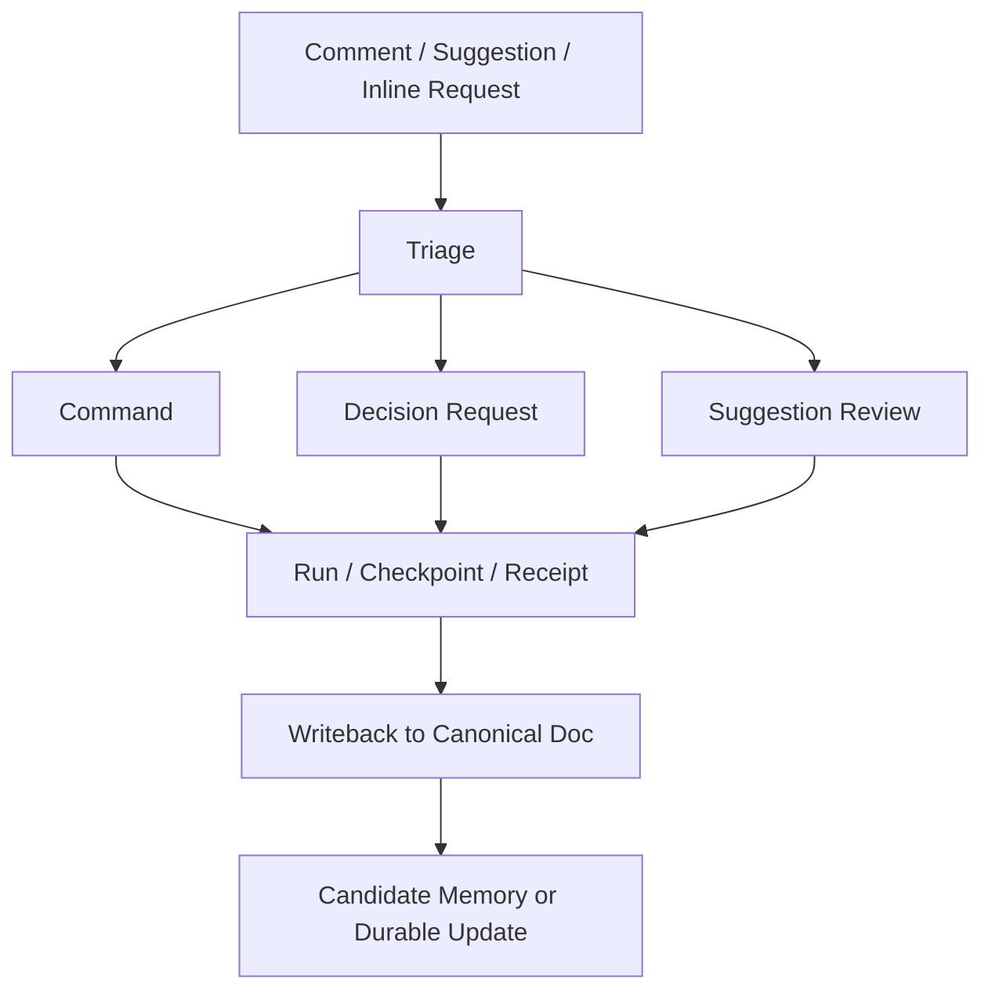

# Cortex vNext Roadmap

最近更新：2026-04-16

## 1. 一句话结论

Cortex 下一阶段不是继续堆更多 agent，而是把已经存在的执行内核产品化成一套完整的协作系统：

`Execution Core -> Decision Hub -> Review Inbox -> Document Orchestration -> Memory Engine -> Context Mounting -> Agent Connect -> Runtime / Mirror Layer`

这份 roadmap 解决 3 个问题：

- Memory Extract 之后，Cortex 还缺哪些关键 feature
- 这些 feature 应该按什么顺序推进
- 本地 Cortex Markdown、Notion、Obsidian 三者之间应该怎么分工

---

## 2. 当前基线

### 2.1 已经有的东西

结合现有文档，Cortex 目前已经不是概念稿，而是已经有一套可运行骨架：

- 执行内核已经成型：`projects / task_briefs / commands / decision_requests / runs / checkpoints / outbox / agent_receipts`
- Review 对象层已经成型：`memory_items / memory_sources / inbox_items / suggestions`
- 评论 direct action 已接通：`comment -> accept/reject/resolve -> Cortex object`
- Connect API 已接通：支持 list / detail / create / verify
- Notion 评论闭环已跑通：评论入队、agent 执行、discussion 回帖
- 本地红灯通知与 `launchd` 常驻托管已打通
- Memory Extract 已经形成一套清晰的提炼、review、durable gate 机制

### 2.2 还没有真正收口的东西

现在真正缺的，不是“再加一个 agent”。

而是下面这些产品层 feature：

- `Decision Hub`
  - 决策分级已经有协议，但还没有真正的决策中枢产品抽象
- `Document Orchestration`
  - 文档里有评论和 suggestion，但还没有完整的“文档内任务编排流”
- `Memory Engine Completion`
  - freshness / revalidation / dedupe / conflict / context mounting 还没有跑成稳定闭环
- `Connect Productization`
  - Connect 还是 API + 文档，不是完整接入工作台
- `Runtime Reliability`
  - 常驻运行、观测、恢复、重放、失败定位还需要真正产品化
- `Mirror Discipline`
  - 本地 Markdown、Notion、Obsidian 之间还缺一套明确的同步规则和模块边界

---

## 3. 真相源分层

这次 roadmap 的前提要先写死，否则后面会继续混乱。

### 3.1 真相源规则

| 内容类型 | Canonical Truth | 作用 | Mirror |
| --- | --- | --- | --- |
| 运行态对象 | Cortex SQLite / Runtime Objects | 承载 command、decision、run、checkpoint、receipt、inbox、memory item 的真实状态 | Notion / Obsidian 只读投影或受控写回 |
| 机制文档 | 本地 `docs/*.md` | 承载 roadmap、架构、SOP、数据模型、角色定义、流程说明 | 同步到 Notion / Obsidian |
| 协作 review | Notion | 承载评论、反馈、accept/reject、discussion | 结构化结果必须回写 Cortex 主端 |
| 个人知识导航 | Obsidian | 承载主题地图、模块化机制说明、关系导航、可视化图谱 | 不作为主真相源 |

### 3.2 执行纪律

- 所有机制说明先写本地 Cortex Markdown，再决定是否同步
- Notion 和 Obsidian 不允许成为独立演化的主文档分支
- 每个镜像页面都应该能回链到对应的 canonical doc
- 同步单位应该是“模块文档”，不是继续堆一个越来越长的总文档

---

## 4. Cortex 的目标产品地图

```mermaid
flowchart LR
    A["Execution Core<br/>任务、命令、运行、回执"] --> B["Decision Hub<br/>拍板、升级、决策记录"]
    B --> C["Review Inbox<br/>待判断 / 待审阅 / 待处理"]
    C --> D["Document Orchestration<br/>文档内任务编排与写回"]
    D --> E["Memory Engine<br/>extract / review / curate / mount"]
    E --> F["Context Mounting<br/>把 durable memory 带进下一次任务"]
    F --> G["Agent Connect<br/>接入、能力、权限、健康"]
    G --> H["Runtime / Observability<br/>常驻、监控、恢复、审计"]
    H --> I["Mirror Layer<br/>Notion / Obsidian 映射"]
```

### 4.1 主要 feature track

| Track | 目标 | 当前状态 | 下一跳 |
| --- | --- | --- | --- |
| `Execution Core` | 保持 Cortex 的任务执行中枢 | 已基本成型 | 继续作为后续全部 feature 的基础层 |
| `Decision Hub` | 统一管理高风险、阻塞型、不可逆决策 | 只有协议，没有完整产品抽象 | 做成标准 decision packet + inbox + audit |
| `Review Inbox` | 让人只处理必须处理的动作 | 对象层已落地 | 统一动作语义与优先级 |
| `Document Orchestration` | 让文档成为任务编排界面，而不是汇报页 | 还在早期 | 建立 comment / suggestion / command / decision / writeback 的完整状态机 |
| `Memory Engine` | 让 durable memory 真正可治理、可复用、可挂载 | 核心模型已明确 | 补 freshness / revalidation / curator / assembler |
| `Context Mounting` | 给后续任务正确挂载 memory 与 recent state | 角色已定义 | 实现 context packet 与默认挂载规则 |
| `Agent Connect` | 把 agent 接入做成稳定金路径 | API 已有 | 做 profile、能力、scope、heartbeat、SOP |
| `Runtime / Observability` | 让 Cortex 成为能长期跑的系统 | 本地托管已起步 | 做健康、告警、重放、故障定位 |
| `Mirror Layer` | 把本地主文档和运行知识映射到 Notion / Obsidian | 规则未完全收口 | 做模块化同步与回链 |

---

## 5. 两个最高优先级 feature

你特别点出来的两件事，确实应该成为 roadmap 的核心主线。

## 5.1 Decision Hub

`Decision Hub` 不是一个普通对象页。

它应该是 Cortex 的“决策中枢机制”，专门承接下面这些输入：

- `red / yellow` 决策请求
- 高风险 suggestion
- 会改变 durable memory 的高风险语义修改
- 文档编排流里出现的阻塞点
- runtime incident 触发的人工拍板需求

### Decision Hub 的最小对象

每条决策都应该收敛成一个 `decision packet`，至少包含：

- `decision_id`
- `project_id`
- `question`
- `context`
- `options`
- `recommended_option`
- `risk_level`
- `blocking_scope`
- `owner_agent`
- `evidence_refs`
- `requested_human_action`
- `due_at`
- `status`

### Decision Hub 的状态流

推荐最小状态：

- `open`
- `approved`
- `rejected`
- `deferred`
- `superseded`
- `expired`

### Decision Hub 的验收标准

- 所有不可逆或高风险动作都能进入统一决策中枢
- 人类可以从统一入口看到“为什么需要拍板”
- 决策结果能回写到：
  - 执行流
  - inbox 状态
  - 文档记录
  - memory 提炼链路

## 5.2 Document Orchestration

`Document Orchestration` 不是“把任务写在文档里”。

它的目标是：

- 让文档成为任务入口
- 让评论成为结构化动作
- 让 suggestion 成为可接受 / 可拒绝的变更提案
- 让执行结果和决策结果能回写到文档的固定位置

### 文档编排流的核心模块

每个项目的 canonical execution doc 最少要能稳定承载：

- `Task Brief`
- `Current Plan`
- `Decision Log`
- `Checkpoints`
- `Open Review`
- `Next Actions`

### 文档编排流的标准链路

### Document Orchestration 的验收标准

- 一条评论能被结构化地转成 command、decision 或 review item
- 每个任务都能回链到文档锚点，而不是漂浮在聊天里
- 执行结果会回写到固定模块，而不是继续追加长汇报
- 决策与审阅结果会关闭对应的文档线程和 inbox item

---

## 6. 推荐推进顺序

roadmap 不应该只按“哪个概念最性感”排序。

应该按依赖关系排序。

## Phase 0：Canonicalization / Freeze

目标：

- 先把术语、文档边界、真相源规则固定住

本阶段包含：

- 产出统一 roadmap
- 锁定“本地 Markdown first，Notion / Obsidian mirror”的规则
- 为每个主要机制指定 canonical doc
- 停止把探索性方案和当前运行模型混写在一起

特别说明：

- 当前 roadmap 里的 Memory Engine，以我们已经确认的 operating model 为准：
  - lifecycle：`candidate / durable / rejected / archived`
  - layer：`base_memory / timeline / knowledge`
  - type：`decision / preference / rule / incident / pattern / open_question`
- 更复杂的 compiler 演进可以继续研究，但不应该成为当前 roadmap 的阻塞前提

退出标准：

- 主要模块都有 canonical doc 归属
- 后续写文档时不再反复切换主源
- Obsidian 至少有一张 roadmap 镜像页可导航

## Phase 1：Runtime Gate + Decision OS

目标：

- 先让 Cortex 具备稳定运行和稳定拍板能力

本阶段包含：

- 长稳验证 `launchd + local_notification + notion loop + workers`
- 健康检查、最近失败路径、最近红黄灯、最近 receipt 的可观测性
- `Decision Hub` 的 `decision packet` 设计与 API / inbox 接入
- 统一 `待判断` 队列和动作语义

依赖：

- `Phase 0`

退出标准：

- 红黄绿灯不只是协议，而是有统一的决策入口
- red 决策可以稳定唤醒并形成闭环
- 人类能从单一入口完成 approve / reject / defer / choose

## Phase 2：Document Orchestration

目标：

- 把文档从“同步页”升级成“任务编排页”

本阶段包含：

- 文档模块规范：`Task Brief / Decision Log / Checkpoints / Open Review / Next Actions`
- comment / suggestion / decision / command 的文档锚点模型
- 文档到结构化动作的转换规则
- 执行结果、审阅结果、决策结果的写回规则

依赖：

- `Phase 1`

退出标准：

- 评论和 suggestion 能可靠转成结构化动作
- 执行结果能回写到固定模块
- 文档不再只是长汇报，而是任务编排界面

## Phase 3：Memory Engine Completion

目标：

- 把已定义的 Memory Extract 机制真正跑成闭环

本阶段包含：

- `Reviewer-Agent -> Reviewer-Human` 两层 durable gate
- `Curator-Agent` 的 dedupe / merge suggestion / archive suggestion / freshness tagging
- `Context Assembler` 的 context packet 规则
- freshness / revalidation / conflict / redundancy 检测
- durable memory 的默认挂载策略

依赖：

- `Phase 1`
- `Phase 2` 的文档编排结果会成为更稳定的 raw input

退出标准：

- durable memory 默认只来自人类最终裁定
- curator 能自动处理低风险整理、提示高风险冲突
- 后续任务可以自动挂载一份可解释的 context packet

## Phase 4：Agent Connect + Team Scale

目标：

- 把多 agent 协作从“会接”升级成“容易接、稳定接、知道谁能做什么”

本阶段包含：

- agent profile、capability、scope、auth、heartbeat
- 外部工程 agent 的 onboarding 金路径
- worker 路由与失败归因
- agent team 的角色模板化

依赖：

- `Phase 1`
- 最好已经有 `Phase 2` 和 `Phase 3` 的输出可供接入 agent 继承

退出标准：

- 至少 `2` 个外部工程 agent 能按统一 SOP 接入
- 新 agent 可继承 task brief、durable memory、recent decision context
- Connect 不再只是后端 API 说明书

## Phase 5：Mirror Layer Productization

目标：

- 把本地 Cortex Markdown 和结构化运行对象稳定映射到 Notion 与 Obsidian

本阶段包含：

- 每个模块文档的镜像策略
- canonical doc 回链
- mirror metadata：
  - `canonical_doc`
  - `mirrored_at`
  - `mirror_scope`
  - `source_hash`
- Obsidian 的主题页、MOC、Canvas 组织
- Notion 的 review / project / discussion 页面组织

依赖：

- `Phase 0`
- 各模块的 canonical docs 已经成型

退出标准：

- 主要机制都能在本地文档和 Obsidian 间稳定对应
- Notion 和 Obsidian 不再各自长出独立分支
- 用户能清楚知道“哪里是主源，哪里是映射”

---

## 7. 机制文档如何一步步进入 Obsidian

工程实现顺序和 Obsidian 梳理顺序不完全一样。

实现上应该先保 runtime 和 decision。
但 Obsidian 里可以按“最适合人类理解”的顺序组织。

### 7.1 推荐的 Obsidian 映射顺序

1. `Cortex Roadmap`
2. `Cortex Decision Hub`
3. `Cortex Document Orchestration`
4. `Cortex Review Inbox`
5. `Cortex Memory Extract`
6. `Cortex Memory Agent Team`
7. `Cortex Memory Generation and Mounting`
8. `Cortex Agent Connect`
9. `Cortex Runtime and Observability`

### 7.2 为什么这样排

- `Roadmap` 先负责总导航
- `Decision Hub` 和 `Document Orchestration` 是当前最缺的两块中枢机制
- `Review Inbox` 是 decision 和 memory 的共同入口
- `Memory` 三篇笔记已经相对成熟，适合在前面三块收口后继续精修
- `Connect` 和 `Runtime` 更适合在机制主线稳定后再沉淀成 wiki 页面

---

## 8. 本轮之后的直接动作

这份 roadmap 落地后，推荐下一步不要再继续扩散讨论。

直接按下面顺序推进：

1. 先把 `Cortex Decision Hub` 写成本地 canonical doc
2. 再把 `Cortex Document Orchestration` 写成本地 canonical doc
3. 然后补 `Cortex Review Inbox`
4. 再回头把这三块同步到 Obsidian，和现有 Memory 主题连起来

这条顺序的好处是：

- 先把“怎么拍板”和“怎么编排任务”写清
- 再让 memory、context mounting、connect 都能挂到一条稳定主线上

---

## 9. 参考文档

- [cortex-vnext-product-framework.md](./cortex-vnext-product-framework.md)
- [prj-cortex-mvp-readiness.md](./prj-cortex-mvp-readiness.md)
- [prj-cortex-execution-doc.md](./prj-cortex-execution-doc.md)
- [cortex-vnext-harness-architecture.md](./cortex-vnext-harness-architecture.md)
- [cortex-vnext-memory-extraction-plan.md](./cortex-vnext-memory-extraction-plan.md)
