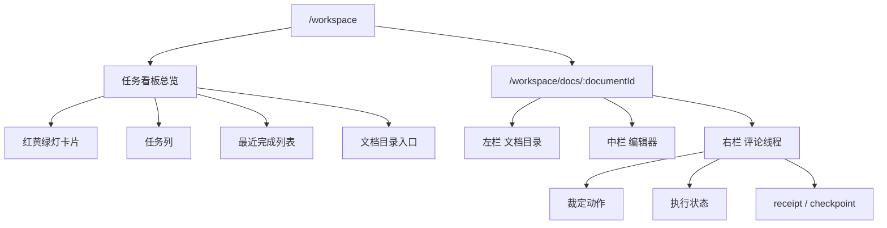
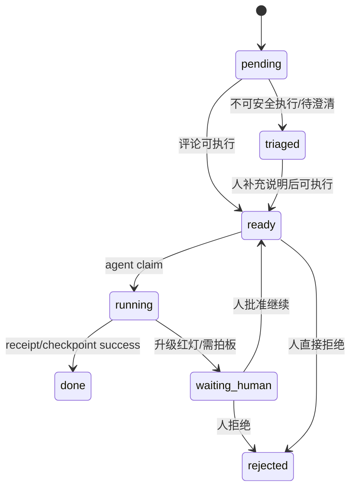
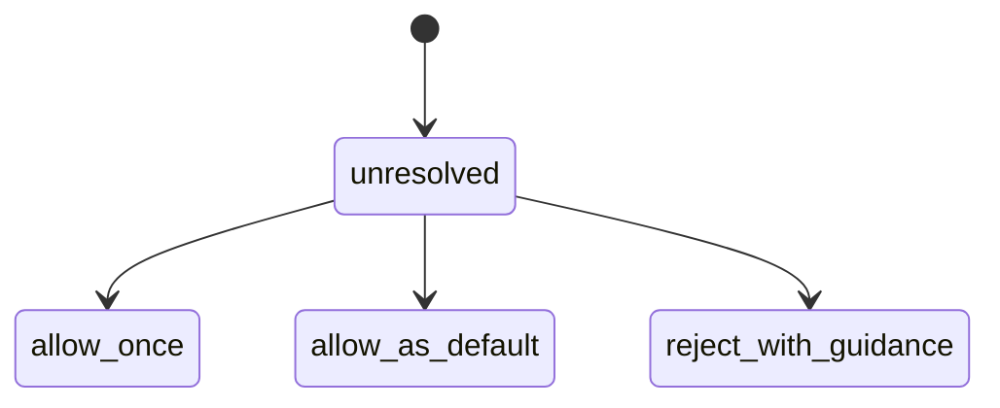

# Cortex 协作工作台实施规格

最近更新：2026-05-08

## 1. 文档目的

这份文档不是再解释为什么要做 Cortex 工作台。

它只回答 4 个问题：

1. 前端到底有哪些页面和模块
2. 每个页面最小需要承载什么信息
3. 后端需要新增哪些对象、接口和状态机
4. 实施顺序怎么拆，才能最快跑通 P0

它基于：

- [Cortex 协作工作台需求稿](./cortex-workspace-requirements.md)
- [Cortex 文档工作台 P0 方案](./cortex-doc-workspace-plan.md)

---

## 2. P0 范围收口

P0 只做两层视图：

1. `任务中台总览页`
2. `单文档三栏协作页`

P0 的核心闭环是：

`看见任务 -> 进入文档 -> 评论/裁定 -> 生成任务动作或决策 -> agent 执行 -> receipt/checkpoint 回写 -> 必要时进入 memory candidate`

P0 明确不做：

- 多人实时协同编辑
- 聊天式工作区
- 复杂权限
- 全量 Notion 替代

---

## 3. 前端信息架构

## 3.1 路由结构

建议先收成 4 个 route：

1. `/workspace?project_id=PRJ-cortex`
   - 任务中台总览页
2. `/workspace/docs/:documentId`
   - 单文档三栏协作页
3. `/workspace/threads/:threadId`
   - thread 独立详情页
4. `/workspace/data/*`
   - 工作台专用 JSON 数据接口

说明：

- `/dashboard` 暂时不删
- P0 可以先让 `/workspace` 复用 `/dashboard` 数据聚合逻辑
- 等新页面稳定后，再考虑是否把 `/dashboard` 重定向过去

## 3.2 页面层级

---

## 4. 总览页规格

## 4.1 页面目标

总览页解决的是“先处理什么任务”。

它不负责深度编辑文档，只负责：

- 看全局风险
- 看执行堆积
- 看哪些任务值得优先处理
- 尽量替代你去多平台轮询
- 把人送到正确的文档或 thread

## 4.1.1 默认视图选择

P0 默认视图建议是 `看板`，不是表格。

原因：

- 你最强的需求是减少注意力碎片化
- 红灯任务必须放在最显眼的位置
- 黄灯任务是第二优先级
- 绿灯任务主要用于自动推进、执行留痕和后续审计

所以交互层更适合按“需要你关注的程度”组织。

这里的默认组织逻辑不是生命周期管理，而是注意力管理。

但首页不应该只有一种组织方式。

P0 建议同一首页保留 2 个切换视图：

- `按注意力`
  - 默认视图
  - 用来分诊
- `按线程`
  - 用同一批 task 按 `thread_label` 分组
  - 用来理解某个协作线程下面到底发生了什么

P0 同时保留一个二级 `表格视图`，用于：

- 多字段筛选
- 审计回看
- 排序导出

## 4.2 页面模块

### A. 顶部项目头部

字段：

- `project_name`
- `project_id`
- `当前轨迹状态`
- `下一步建议`
- `入口链接`

数据来源：

- 现有 `task-dashboard hero`

### B. 核心计数卡片区

P0 卡片先做 6 张：

- `红灯任务`
- `黄灯任务`
- `绿灯任务`
- `执行中`
- `等待人工`
- `最近完成`

计数口径：

- `红灯任务`
  - 决策信号 = red 的 task
- `黄灯任务`
  - 决策信号 = yellow 的 task
- `绿灯任务`
  - 决策信号 = green 的 task
- `执行中`
  - running command
  - running run
  - task_status = in_progress
- `等待人工`
  - task_status = waiting_human
- `最近完成`
  - done task
  - recent receipt
  - latest passed checkpoint

### C. 视图切换区

P0 首页在核心计数卡下方提供一个轻量视图切换：

- `按注意力`
- `按线程`

## 4.2.1 默认看板列

P0 默认列建议：

- `红灯待拍板`
- `黄灯绕行中`
- `自动推进中`
- `已完成`

说明：

- `红灯待拍板`
  - 用户现在最需要关注
- `黄灯绕行中`
  - 当前有不确定性，但系统会先继续推进其他 green 工作
  - green 路径跑完后，再自动回看或等待异步评论
- `自动推进中`
  - 绿灯为主，agent 正在自行推进
- `已完成`
  - 主要用于回看、审计、复盘

注意：

- 这些列首先表达的是“是否需要人关注”
- 它们不是 task 生命周期本身
- task 生命周期仍由 `task_status` 驱动

同时也不是 agent run 的直接状态。

更准确地说：

- task 是首页管理单位
- thread / decision point 是任务内部的判断点
- run 是 agent 实际执行的观测单位

### C. 列表区一：需要立即拍板

展示：

- red task
- waiting_human task

每项展示：

- 标题
- 风险等级
- 需要动作
- owner agent
- 最近更新时间
- 点击入口

点击行为：

- 如果关联 `document_id`，进入对应文档页并高亮 task 对应 thread
- 如果关联 `decision_id` 但无文档，则打开 thread/detail 页

### D. 列表区二：黄灯绕行与待回看

展示：

- yellow task
- triaged task
- 低置信度待澄清 task

用途：

- 让人集中回看“当前不必立刻打断，但后续不能丢”的事项

### E. 列表区三：最近完成

展示：

- completed command
- recent receipt
- checkpoint

用途：

- 帮人快速判断系统最近到底推进了什么

### F. 列表区四：文档目录摘要

展示：

- 文档标题
- 未处理 task 数
- 最近更新时间

用途：

- 从总览页直接进入单文档协作页

## 4.2.2 按线程分组视图

这个视图不是把 thread 直接当成最小执行单位。

它只是把同一批 `task` 换一种组织方式：

- 每个分组对应一个 `thread_label`
- 分组内仍然展示 task 卡片

每个线程分组头部最小字段：

- `thread_label`
- `thread_key`
- `task_count`
- `in_progress_count`
- `red_count`
- `latest_updated_at`

分组内展示：

- 该线程下所有 task
- 默认按 `red -> yellow -> green -> done` 排序

## 4.3 总览页最小交互

- 支持按 `red / yellow / green / in_progress / waiting_human / done` 过滤
- 支持按文档过滤
- 支持点击任务跳转文档或 thread

P0 暂不做：

- 拖拽排序
- 批量裁定
- 多维复杂筛选

---

## 5. 单文档三栏页规格

## 5.1 页面目标

文档页解决的是“在一个上下文里完成异步协作和任务推进”。

它必须同时承载：

- 文档正文
- 任务对应的评论线程
- 执行状态
- 人类裁定
- receipt/checkpoint 回写

## 5.2 左栏：文档目录

### 展示字段

- 文档标题
- 文档类型
- 未处理 task 数
- 当前是否选中

### 支持动作

- 切换文档
- 新建文档
- 快速跳到：
  - 执行文档
  - memory 文档
  - decision 文档

### P0 数据来源

- 本地 project workspace
- `docs/projects/:projectSlug/*`

### P0 非目标

- 树形多级拖拽
- 富权限共享

## 5.3 中栏：编辑器

### 展示/编辑能力

- 标题
- block 内容
- heading / paragraph / list / quote
- 选区高亮
- 评论锚点标记

### 必须支持的动作

- 编辑文档
- 自动保存
- 选中文本后创建 thread
- 点击锚点显示右栏对应 thread

### 数据形态

P0 推荐双存：

- `markdown_source`
- `editor_json`

原因：

- Markdown 保证本地真相源一致
- editor JSON 保障前端交互和锚点稳定性

### P0 非目标

- 表格
- 数据库 block
- 富媒体 block 全兼容

## 5.4 右栏：评论线程

### 线程列表项字段

- `task title`
- `thread title`
- `anchor excerpt`
- `intent`
- `execution status`
- `human resolution`
- `owner agent`
- `last activity`

### 单个 thread 详情需要展示

- task 摘要
- thread 关联原文摘录
- 所有 comments
- classifier 判断结果
- 当前执行状态
- 当前裁定结果
- 关联 command
- 关联 decision
- 关联 receipt
- 关联 checkpoint

### 右栏动作

- `允许`
- `允许，以后无需询问`
- `拒绝，并给出指导意见`
- `重试`
- `转 triage`
- `打开关联执行记录`

### 状态展示原则

一个 task / thread 永远同时显示两层信息：

1. `执行状态`
2. `人类裁定结果`

不要把这两个维度混成一个 badge。

---

## 6. 线程状态机

## 6.1 执行状态机

## 6.2 人类裁定状态机

说明：

- `execution status` 解决“系统在干什么”
- `resolution` 解决“人最终怎么判断”

## 6.3 task、thread、run 的关系

这 3 层一定要分开看：

### `task`

- 回答：这件工作整体现在处于什么状态
- 用在：首页卡片、看板分诊、项目管理

### `thread`

- 回答：任务内部具体哪个判断点需要 review / 绕行 / 拍板
- 用在：右栏评论线程、裁定动作、文档内异步协作

### `run`

- 回答：某个 agent 这一轮到底有没有在跑、跑到哪一步、有没有卡住
- 用在：运行中 agent、执行脉搏、最近执行记录

一个 task 可以关联多个 thread，也可以关联多次 run。

所以：

- 红黄绿灯不是 run 本身
- run 也不该直接成为首页主卡片
- 但首页必须让 run 维度的“执行脉搏”可见，例如通过摘要卡片、卡片状态字段或次级信息暴露出来

---

## 7. 后端对象模型

## 7.1 新增对象

P0 建议新增 5 张主表：

1. `tasks`
2. `documents`
3. `document_threads`
4. `thread_comments`
5. `thread_links`

补充说明：

- `receipt`、`checkpoint`、`command`、`decision` 先不新建表
- 继续复用现有对象
- `tasks` 是总览页最小操作单元
- `thread_links` 用来统一映射 task、thread 和已有执行对象的关系

## 7.2 tasks

建议字段：

- `task_id`
- `project_id`
- `document_id`
- `thread_key`
- `thread_label`
- `title`
- `summary`
- `task_status`
- `decision_signal`
- `priority`
- `owner_agent`
- `current_thread_id`
- `source_type`
- `source_ref`
- `created_at`
- `updated_at`
- `completed_at`

`task_status` P0 枚举：

- `todo`
- `in_progress`
- `waiting_human`
- `done`
- `blocked`

`decision_signal` P0 枚举：

- `red`
- `yellow`
- `green`

说明：

- 对用户来说，这两套状态在首页默认会被压缩成关注优先级
- 对系统来说，两者必须分开存
- 前者回答“任务跑到哪一步了”，后者回答“现在需不需要人介入”
- `thread_key` 是稳定机器标识
- `thread_label` 是给人看的线程名，例如 `Cortex / Memory Extract 重构`

## 7.3 documents

建议字段：

- `document_id`
- `project_id`
- `slug`
- `title`
- `document_type`
- `markdown_source`
- `editor_json`
- `source_path`
- `created_at`
- `updated_at`

`document_type` P0 枚举：

- `execution`
- `memory`
- `decision`
- `general`

## 7.4 document_threads

建议字段：

- `thread_id`
- `task_id`
- `project_id`
- `document_id`
- `anchor_type`
- `anchor_payload`
- `anchor_excerpt`
- `title`
- `status`
- `resolution`
- `risk_level`
- `intent`
- `intent_confidence`
- `execution_policy`
- `owner_agent`
- `opened_by`
- `created_at`
- `updated_at`
- `resolved_at`

说明：

- `task_id` 用于把 thread 归属到单个任务
- `intent` 来自 classifier
- `execution_policy` 可复用现有 comment-intent 输出
- `risk_level` 可以作为 thread 级别信号，但首页优先读 `decision_signal`

## 7.5 thread_comments

建议字段：

- `comment_id`
- `thread_id`
- `project_id`
- `body`
- `author_type`
- `author_id`
- `author_name`
- `intent`
- `intent_confidence`
- `execution_policy`
- `self_authored`
- `created_at`

`author_type` 枚举：

- `human`
- `agent`
- `system`

## 7.6 thread_links

建议字段：

- `link_id`
- `thread_id`
- `task_id`
- `object_type`
- `object_id`
- `relation_type`
- `created_at`

`object_type` P0 枚举：

- `command`
- `decision`
- `checkpoint`
- `receipt`
- `memory_candidate`

`relation_type` P0 枚举：

- `triggered_by`
- `generated`
- `resolved_by`
- `evidence_for`

---

## 8. API 设计

## 8.1 总览页接口

### `GET /workspace/overview`

输入：

- `project_id`
- `include_synthetic`

输出：

- hero
- counts
- active_view
- urgent_tasks
- review_tasks
- in_progress_tasks
- completed_tasks
- running_runs
- thread_groups
- document_summaries

实现建议：

- 初期直接复用 `task-dashboard` 的聚合函数
- 再逐步把 thread 维度加进去

说明：

- `urgent_tasks`
  - 顶层红灯 task
- `review_tasks`
  - 顶层 yellow task，但语义是“绕行中/待回看”，不是“必须现在停下来处理”
- `in_progress_tasks`
  - 绿灯主导的推进中 task
- `running_runs`
  - 当前 agent 执行脉搏层，用来回答“哪些 agent 正在跑，哪些 run 卡住了”
- `thread_groups`
  - 同一批 task 的按线程聚合结果
  - 用于首页 `按线程` 视图

## 8.2 文档接口

### `GET /workspace/documents`

输入：

- `project_id`

输出：

- documents[]
- unresolved_task_count

### `GET /workspace/documents/:documentId`

输出：

- document
- tasks_summary
- threads_summary

### `PATCH /workspace/documents/:documentId`

输入：

- `title`
- `markdown_source`
- `editor_json`

输出：

- updated document

## 8.3 task 接口

### `GET /workspace/tasks`

输入：

- `project_id`
- `task_status`
- `decision_signal`
- `document_id`

输出：

- tasks[]
- thread_groups[]

### `GET /workspace/tasks/:taskId`

输出：

- task
- threads[]
- linked_objects[]

### `POST /workspace/tasks`

输入：

- `project_id`
- `document_id`
- `title`
- `summary`
- `priority`
- `owner_agent`

输出：

- created task

### `POST /workspace/tasks/:taskId/approve`

输入：

- `actor_id`
- `note`

系统处理：

- 如果当前 task 在 `waiting_human`
- 允许恢复执行
- 必要时同步更新对应 thread.resolution = `allow_once`

### `POST /workspace/tasks/:taskId/reject`

输入：

- `actor_id`
- `note`

系统处理：

- 标记 task 为 `blocked`
- 必要时同步更新对应 thread.resolution = `reject_with_guidance`

## 8.4 thread 接口

### `POST /workspace/threads`

用途：

- 从选区创建 thread

输入：

- `project_id`
- `task_id`
- `document_id`
- `anchor_type`
- `anchor_payload`
- `anchor_excerpt`
- `title`
- `body`
- `author_type`
- `author_id`

系统处理：

- 创建 thread
- 创建首条 comment
- 运行 intent classification
- 更新 thread 的 `intent / execution_policy / status`

### `GET /workspace/threads/:threadId`

输出：

- thread
- task
- comments[]
- linked_objects[]

### `POST /workspace/threads/:threadId/comments`

用途：

- 给已有 thread 继续回复

输入：

- `body`
- `author_type`
- `author_id`

系统处理：

- 追加 comment
- 再次跑 classifier
- 如可执行则可入队

### `POST /workspace/threads/:threadId/resolve`

输入：

- `resolution`
- `guidance`
- `actor_id`

`resolution` 允许：

- `allow_once`
- `allow_as_default`
- `reject_with_guidance`

系统处理：

- 更新 thread.resolution
- 更新 thread.status
- 同步更新 task 关注状态
- 触发 command / memory candidate / reject path

## 8.5 执行桥接接口

### `POST /workspace/threads/:threadId/enqueue`

用途：

- 显式把当前 thread 变成 command
- 必要时更新 task_status = `in_progress`

### `GET /workspace/threads/:threadId/activity`

输出：

- linked command
- linked decision
- linked receipt
- linked checkpoint

---

## 9. 评论到执行的桥接逻辑

## 9.1 classifier 输出复用

直接复用：

- [comment-intent.js](/Users/yusijua/Desktop/cortex-workflow-p0/src/comment-intent.js)

映射规则：

- `executionPolicy = enqueue`
  - thread.status -> `ready`
- `executionPolicy = inbox_only`
  - thread.status -> `triaged`
- `executionPolicy = reject`
  - thread.status -> `rejected`

## 9.2 风险映射

P0 先用简化规则：

- `decision_context.signal_level = red`
  - thread.risk_level = `red`
  - task.decision_signal = `red`
- `decision_context.signal_level = yellow`
  - thread.risk_level = `yellow`
  - task.decision_signal = `yellow`
- 普通 continue/improve/retry comment
  - thread.risk_level = `green`
  - task.decision_signal = `green`
- needs_clarification / feedback
  - thread.risk_level = `yellow`
  - task.decision_signal = `yellow`
- reject / unsafe
  - thread.risk_level = `red`
  - task.decision_signal = `red`

## 9.2.1 首页关注优先级映射

首页默认不用让用户同时理解两套状态，而是合并成关注优先级：

- `红灯待拍板`
  - `decision_signal = red`
  - 或 `task_status = waiting_human`
- `黄灯绕行中`
  - `decision_signal = yellow`
  - 或 `thread.status = triaged`
- `自动推进中`
  - `decision_signal = green`
  - 且 `task_status = in_progress`
- `已完成`
  - `task_status = done`

这套映射的目标不是还原底层状态，而是让首页先回答一个更重要的问题：

`现在最值得你看的是哪一批任务，以及哪些任务虽然没停机，但后面需要回看？`

## 9.3 command 生成规则

满足以下条件才自动入队：

- `executionPolicy = enqueue`
- thread 当前不是 `rejected`
- thread 当前不是 `waiting_human`

自动生成 command 时：

- 写入 `source = workspace_thread`
- 回填 `thread_links`
- owner agent 复用现有 routing 逻辑
- 同步更新 `task_status = in_progress`

---

## 10. Memory 回流规则

P0 只接两类：

### `allow_as_default`

触发：

- 生成 memory candidate

默认 type 倾向：

- `preference`
- `rule`
- `decision`

默认 layer 倾向：

- `base_memory`
- `knowledge`

### `reject_with_guidance`

触发：

- 生成 memory candidate 或 incident signal

默认 type 倾向：

- `rule`
- `incident`
- `open_question`

注意：

- P0 不自动升 durable
- 仍走现有 reviewer / curator 流程

---

## 11. 实施顺序

## Step 1：先把总览页产品化

目标：

- 在不引入 editor 的前提下，先把默认看板 `/workspace` 跑起来

任务：

- 基于现有 `/dashboard` 复制或升级出 `/workspace`
- 调整为 `看板优先，表格次之`
- 补“文档摘要区”和“任务跳转位”

验收：

- 可以在一个页面里看见 `红灯待拍板 / 黄灯绕行中 / 自动推进中 / 已完成`

## Step 2：新增 tasks / documents / threads 数据层

目标：

- 给三栏页准备对象模型

任务：

- store schema migration
- task CRUD
- document CRUD
- thread CRUD
- thread_links

验收：

- 可以创建一个 task，并关联文档和 thread

## Step 3：三栏页壳子

目标：

- 页面结构先成立

任务：

- 左栏目录
- 中栏 editor spike
- 右栏 task/thread rail

验收：

- 可以从总览页跳进某份文档
- 可以看到对应 task 和 thread

## Step 4：接通 comment-intent

目标：

- 把评论线程变成执行入口

任务：

- 创建 comment 时调用 classifier
- 把 intent / status / executionPolicy 显示出来
- 允许 enqueue / triage / reject

验收：

- 可执行评论可以转成 command

## Step 5：接通 receipt/checkpoint 回写

目标：

- 把 thread 真正接进执行闭环

任务：

- command 完成后，回写 thread activity
- 右栏显示 receipt / checkpoint

验收：

- thread 可以从评论一路跑到 done

## Step 6：接通 memory candidate

目标：

- 让高价值裁定动作进入复利链路

任务：

- `allow_as_default`
- `reject_with_guidance`

触发 memory projection

验收：

- thread 可成为 memory candidate 的稳定入口

---

## 12. 当前最值得立刻做的事

如果现在直接开始写代码，我建议按这个顺序：

1. 新建 `docs/cortex-workspace-implementation-spec.md`
2. 先把 `/workspace` 默认看板做出来，复用现有 `/dashboard` 聚合逻辑
3. 再补 `tasks / documents / threads / thread_comments / thread_links` 数据层
4. 然后再上 editor 和三栏页

原因很简单：

- 总览页最快出效果
- 数据层先立住，后面 editor 和 thread UI 才不会返工
- comment-intent 现成可复用，能加速闭环
