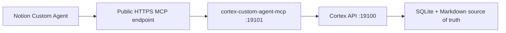

# Notion Custom Agent Router Checklist

最近更新：2026-05-12

## 2026-05-12 当前真实状态

Custom Agent 主路径仍然保留，但不能再把它当成唯一触发器。今天真机验证发现：Notion 评论可能只触发 reaction，不触发 MCP `ingest_notion_comment`，因此 Cortex 侧需要一个稳定的 token-based comment bridge 兜底。

当前已经完成：

- 新增 `src/notion-comment-poller.js`
- `automation:start` 默认会在 `NOTION_API_KEY + 当前项目 Notion page scope` 可用时拉起 `notion-comment-poller`
- 默认只扫当前项目，避免旧项目未授权页面持续 404
- 新评论按 `comment_id` 去重后进入 `/webhook/notion-comment`
- `更新目前项目执行的最新动态到文档中` 这类请求已明确路由到 `agent-notion-worker`
- `agent-notion-worker` 对这类请求会实际执行 `execution:notion-sync`

验收证据：

- 补摄入原评论：`CMD-20260512-009`
- 纠正后执行命令：`CMD-20260512-017`
- Notion discussion 已收到执行完成回帖
- runtime 当前 `11 / 11` running，新增 `notion-comment-poller`
- 全量测试 `npm test`：`278 / 278`

## 2026-04-29 当前根因结论

如果问“为什么我们到现在还没有真正成功接入过一个 Custom Agent”，当前最准确的答案是：

- 不是 Cortex 本地 runtime 没准备好
- 不是 `/notion/custom-agent/context` 或 `/webhook/notion-custom-agent` 没通
- 也不是 MCP tool 面不存在
- 当前真实 blocker 是：**还没有配置一个当前可用的公网 HTTPS MCP URL**

这轮已经新增一个固定检查命令：

```bash
npm run agent:setup-bundle -- --project PRJ-cortex
```

当前它会直接返回：

- `local_mcp.ok = true`
- `cortex_context.ok = true`
- `status = action_required`
- `blockers = ["public_mcp_url_missing"]`

也就是说：

- 本地 Cortex 侧已经 ready
- Bearer 鉴权也已经准备好
- 但 Notion 云端还没有一个能连进你这台机器的当前公网 MCP 地址

如果你现在是要切一个新的 Notion workspace / 根页，不要只跑默认检查，要直接带上目标页面：

```bash
npm run agent:setup-bundle -- \
  --project PRJ-cortex \
  --target-page-url "https://www.notion.so/Cortex-35beb0c2e3f780309d79ddb2bd3c44b6?source=copy_link"
```

这会额外告诉你两件事：

- 这个新页面有没有被当前 `PRJ-cortex` 的 page scope 接住
- 现在卡住的是 `public_mcp_url_missing`、`local_mcp_unhealthy`，还是 `target_page_out_of_scope`

还要记住一个经常混淆的点：

- `Codex -> Notion MCP OAuth` 和 `NOTION_API_KEY` 是两条独立的权限链
- 前者决定我能不能在当前会话里直接读到那个页面
- 后者决定 `notion:bootstrap / notion:sync-all / memory:notion-sync / execution:notion-sync` 这些脚本能不能写进去
- 所以排障时要两边都看：
  - `notion_fetch <page-url>` 看 MCP OAuth
  - `npm run notion:diagnose -- "<page-url>"` 看 token integration

## 2026-05-09 当前真实状态

上面这段是旧阶段的根因记录，现在已经不是当前 blocker。

按最新仓库状态：

- `CORTEX_MCP_PUBLIC_URL` 已配置为 `https://tricky-paws-sit.loca.lt/mcp`
- `npm run agent:setup-bundle -- --project PRJ-cortex --target-page-url "https://www.notion.so/Cortex-35beb0c2e3f780309d79ddb2bd3c44b6?source=copy_link"` 当前返回：
  - `status = ready_for_notion_setup`
  - `blockers = []`
  - `target_page.in_project_scope = true`
- `/workspace` 首页也已新增 `Notion 协作接入` 面板，可直接看到：
  - `Custom Agent` 主路径是否 ready
  - `token-based mirror` 是否另行授权
  - 当前任务线程是不是来自 `Notion 讨论 / 会话线程 / 其他回退来源`

所以现在真正还没完成的，不是 Cortex runtime，也不是 MCP tool 面，而是 Notion UI 侧最后一步人工挂接：

1. 在 Notion 里创建或打开名为 `Cortex` 的 Custom Agent
2. 给它挂 MCP connection：
   - URL：`https://tricky-paws-sit.loca.lt/mcp`
   - Header：`Authorization: Bearer <CORTEX_MCP_BEARER_TOKEN>`
3. 开启 mention / comment triggers
4. 在真实页面里发起第一条 `@Cortex` 绿色评论，验证 comment -> command -> receipt

这也解释了为什么仓库里仍然会提到 integration：

- `Custom Agent + MCP` 是 Notion 里直接 `@Cortex` 的主路径
- `NOTION_API_KEY` integration 只是可选镜像路径，用于 `bootstrap / sync-all / memory:notion-sync`
- 即使 integration 还没共享目标页，也不该再阻塞 `@Cortex` 这条主路径

## 目标

这份文档只做一件事：

- 把 `docs/notion-custom-agents-collaboration.md` 里的 `Phase 1 Router Agent` 落成一份可执行的 Notion 侧配置清单和联调 checklist

P0 目标不是在 Notion 里搭一个完整 agent team。

P0 目标是先把这条主链路打通：

1. 人在 Notion 页面或 discussion 里 `@Cortex`
2. `Cortex` 读取上下文并调用 Cortex API
3. Cortex 决定进入 `command` / `decision_request` / `ignored`
4. 后续执行与回执继续围绕同一个 discussion 展开

## 先把名词讲清楚

这里的主路径是：

- `Custom Agent`：Notion 里可直接 `@` 的入口，推荐外显名称就是 `Cortex`
- `Connection`：在 `Tools & Access -> Add connection` 里挂的能力连接
- `Cortex runtime`：连接后面真正执行命令、沉淀 memory、写 checkpoint 的本地内核

所以 `Add connection` 不是在回退旧 token integration，而是在给 `Custom Agent` 挂执行能力。

## P0 最小接入面

当前只需要这 4 个东西：

1. 一个 Notion Custom Agent
   - 推荐名称：`Cortex`
   - `Router` 是内部职责，不建议继续暴露成最终对外名字
2. 两个触发器
   - `The agent is mentioned in a page or comment`
   - `A comment is added to a page`
3. 一个 Custom Agent 可挂载的 MCP 工具入口
   - MCP endpoint：`/mcp`
   - 本地启动脚本：`npm run mcp:server`
   - 默认本地地址：`http://127.0.0.1:19101/mcp`
   - Notion 侧必须使用公网 HTTPS 地址，不能直接使用 `127.0.0.1`
4. 四个最小 MCP tools
   - `get_cortex_context`
   - `ingest_notion_comment`
   - `claim_next_command`
   - `submit_agent_receipt`
5. 一个固定项目 id
   - `PRJ-cortex`

P0 不要求：

- 在 Notion 里暴露多个 Custom Agents
- 在 Notion 里直接维护 durable memory
- 用 legacy integration token 主动把本地文档镜像回 Notion

## Cortex 侧前置条件

在配置 Notion Custom Agent 之前，先确认 Cortex 本地服务已经准备好。

### 1. 服务可访问

- Cortex API 本地可访问
- 至少能请求：
  - `GET /notion/custom-agent/context?project_id=PRJ-cortex`
  - `POST /webhook/notion-custom-agent`
- Cortex Custom Agent MCP 本地可访问
- 至少能请求：
  - `GET /health`
  - `POST /mcp`

### 2. 项目页面范围已配置

建议至少配置一个项目根页面 id，否则 page scope guard 无法生效。

可配置的项目页面字段：

- `root_page_url`
- `notion_parent_page_id`
- `notion_review_page_id`
- `notion_memory_page_id`
- `notion_scan_page_id`

推荐做法：

- 至少配置 `root_page_url` 或 `notion_parent_page_id`
- 如果 review / memory / scan 页面也是这个项目树的一部分，也一起配置

如果你准备迁到一个新的 Notion workspace 根页，额外再看一条：

- `agent:setup-bundle --target-page-url ...` 里如果出现 `target_page_out_of_scope`
- 说明当前 `PRJ-cortex` 仍然绑定的是旧页面树
- 此时就算新页面已经分享给 Codex / token，Notion comment 进入 Cortex 后也会被 `scope_guard` 判成 `out_of_scope_page`

处理方式：

1. 先用 `npm run notion:diagnose -- "<new-page-url>"` 确认 `NOTION_API_KEY` 对这个新页面可见。
2. 再用 `npm run notion:bootstrap -- "<new-page-url>"` 在这个新根页下创建新的：
   - 工作台页
   - 协作记忆页
   - 执行文档页
3. `bootstrap` 会自动把新的 page ids 回写到 `PRJ-cortex` 项目配置和 `docs/notion-routing.json`。

### 3. 默认模式是 Custom Agent

当前默认路径应该是：

- `NOTION_COLLAB_MODE=custom_agent`
- 不依赖 `NOTION_API_KEY`
- 不存在并行的 `notion-loop` 轮询主链路

## Cortex MCP 门面

Notion Custom Agent 不应该直接调用本机 `127.0.0.1:19100` REST API。  
正式接入方式是让 Notion 调用一个公网 HTTPS MCP endpoint，再由这个 MCP 门面转发到本地 Cortex REST 内核。



本地启动：

```bash
npm run mcp:server
```

如果需要给 Notion 访问，需要把 `19101` 暴露成公网 HTTPS。临时联调用 tunnel，长期建议部署一个固定的 relay / MCP facade。

临时 tunnel 启动时建议：

```bash
CORTEX_MCP_HOST=0.0.0.0 npm run mcp:server
```

如果启用了 host header 白名单，需要把 tunnel 域名加入：

```bash
CORTEX_MCP_ALLOWED_HOSTS=your-tunnel-domain.example.com npm run mcp:server
```

公网暴露时建议启用 Bearer 鉴权：

```bash
CORTEX_MCP_BEARER_TOKEN=replace-with-secret npm run mcp:server
```

Notion Custom Agent 侧连接 MCP server 时同步配置：

- Header：`Authorization`
- Value：`Bearer replace-with-secret`

MCP tools 与 Cortex 内核映射：

| MCP tool | Cortex REST 内核 | 用途 |
|---|---|---|
| `get_cortex_context` | `GET /notion/custom-agent/context` | 读取项目态、红黄绿规则、scope guard、loop guard |
| `ingest_notion_comment` | `POST /webhook/notion-custom-agent` | 把 Notion 评论/mention 变成 command、decision_request 或 ignored |
| `claim_next_command` | `POST /commands/claim-next` | Router 或下游 agent 领取下一条任务 |
| `submit_agent_receipt` | `POST /webhook/agent-receipt` | 写入执行进展、完成回执、失败回执或红黄灯信号 |

## Notion 侧配置清单

### 0. 官方前置权限

Notion 侧需要先允许 Custom MCP server：

- workspace owner 或有权限的 admin 需要在 Notion AI / AI connectors 里开启 Custom MCP servers。
- 在 Custom Agent 的 Tools & Access 里添加 `Custom MCP server`。
- MCP URL 填公网 HTTPS endpoint，例如 `https://gentle-windows-doubt.loca.lt/mcp`。
- 如果开启 `CORTEX_MCP_BEARER_TOKEN`，在 Notion 连接里配置 `Authorization: Bearer <token>`。

### 1. 创建 Agent

在 Notion 里创建一个新的 `Custom Agent`：

- Name: `Cortex`
- Role: Router / triage / async collaboration entrypoint

### 1.1 连接 MCP 工具

给 `Cortex` 添加 MCP server：

- Transport：Streamable HTTP
- URL：公网 HTTPS 地址，例如 `https://your-domain.example.com/mcp`
- 本地直连地址 `http://127.0.0.1:19101/mcp` 只能给本机 MCP client 测试，Notion 云端无法访问

连接后确认可见 4 个 tools：

- `get_cortex_context`
- `ingest_notion_comment`
- `claim_next_command`
- `submit_agent_receipt`

### 2. 打开触发器

打开这两个触发器：

- `The agent is mentioned in a page or comment`
- `A comment is added to a page`

原因：

- mention trigger 负责显式拉起 Cortex
- comment trigger 负责异步读评持续推进

### 3. 给 Agent 的系统职责

不要把它定义成“什么都做的大总管”，只定义成路由器。

推荐职责：

1. 读取当前 page、block、discussion、comment 上下文
2. 调 MCP tool `get_cortex_context`
3. 判断当前事件是 `green` / `yellow` / `red`
4. 调 MCP tool `ingest_notion_comment` 把事件写回 Cortex
5. 根据 Cortex 返回结果决定：
   - `command`：继续执行或等待下游 agent
   - `decision_request`：在 Notion 里说明已进入 review / decision
   - `ignored`：不继续推进，避免误触发

### 4. 给 Agent 的系统 Prompt

下面这段可以作为 Phase 1 的直接起点：

```text
You are Cortex, the single async collaboration entrypoint for Cortex in Notion.

Your job:
1. Read the current page, discussion, and comment context.
2. Fetch project context with the MCP tool get_cortex_context.
3. Classify the event as green, yellow, or red.
4. Send the event to Cortex with the MCP tool ingest_notion_comment.
5. Continue collaboration in the same Notion discussion when the event is green or yellow.
6. Stop execution escalation when the event is red and let Cortex trigger the human notification path.

Rules:
- Cortex local Markdown + SQLite is the source of truth.
- Notion is the async collaboration surface, not the durable truth store.
- Do not silently skip red-risk decisions.
- Prefer explicit owner_agent or route_to when the user intent already implies a role.
- Pass self_authored=true for agent-written comments when possible.
- Pass page_ancestry_ids when the comment happens on a project child page.
```

### 5. 给 Agent 的工具边界

Phase 1 只开放最小工具集：

- `get_cortex_context`
- `ingest_notion_comment`
- `claim_next_command`
- `submit_agent_receipt`

如果 Notion 侧工具管理支持备注，请写清：

- `context` 只负责读项目态
- `ingest_notion_comment` 只负责写入事件
- `claim_next_command` 和 `submit_agent_receipt` 是下游执行链路，不是 Router 每次都要直接调用

## 事件载荷模板

### 最小可用载荷

```json
{
  "project_id": "PRJ-cortex",
  "page_id": "notion-page-id",
  "discussion_id": "notion-discussion-id",
  "comment_id": "notion-comment-id",
  "body": "human instruction or review comment",
  "invoked_agent": "Cortex",
  "owner_agent": "agent-router",
  "source_url": "notion://page/notion-page-id/discussion/notion-discussion-id/comment/notion-comment-id"
}
```

### 推荐生产载荷

```json
{
  "project_id": "PRJ-cortex",
  "page_id": "notion-page-id",
  "target_type": "page_comment",
  "target_id": "notion-block-or-page-id",
  "discussion_id": "notion-discussion-id",
  "comment_id": "notion-comment-id",
  "body": "human instruction or review comment",
  "context_quote": "the paragraph or task sentence around the comment",
  "anchor_block_id": "optional notion block id",
  "invoked_agent": "Cortex",
  "owner_agent": "agent-router",
  "route_to": "agent-pm",
  "source_url": "notion://page/notion-page-id/discussion/notion-discussion-id/comment/notion-comment-id",
  "self_authored": false,
  "page_ancestry_ids": ["ancestor-page-id", "project-parent-page-id"],
  "created_by": {
    "id": "notion-user-id",
    "type": "person_or_bot",
    "name": "comment author"
  },
  "invoked_agent_actor_id": "notion-user-id-of-cortex-router"
}
```

## Cortex 返回语义

### 1. 普通执行

当 Cortex 接收为普通执行事件时，典型返回是：

```json
{
  "ok": true,
  "workflow_path": "command",
  "command_id": "CMD-...",
  "owner_agent": "agent-router"
}
```

含义：

- 这条 comment 已经成功落成 command
- 后续可由 Router 自己继续，或由下游 executor claim

### 2. Yellow / Red 决策流

当 Cortex 识别为需要 review / decision 时，典型返回是：

```json
{
  "ok": true,
  "workflow_path": "decision_request",
  "decision_id": "DEC-...",
  "signal_level": "yellow"
}
```

或者：

```json
{
  "ok": true,
  "workflow_path": "decision_request",
  "decision_id": "DEC-...",
  "signal_level": "red",
  "outbox_queued": true
}
```

含义：

- `yellow`：进入 review / clarification 流
- `red`：进入人工拍板流，并触发本地系统通知

### 3. 被保护性忽略

以下两种情况 Cortex 会显式忽略：

1. 自己回复自己

```json
{
  "ok": true,
  "skipped": true,
  "skip_reason": "self_authored_comment",
  "workflow_path": "ignored"
}
```

2. 评论不在当前项目页面范围内

```json
{
  "ok": true,
  "skipped": true,
  "skip_reason": "out_of_scope_page",
  "workflow_path": "ignored"
}
```

## 联调 Checklist

不要直接冲全链路，按下面顺序一项项验。

### Step 1. Context 接口可读

请求：

```bash
curl "<CORTEX_BASE_URL>/notion/custom-agent/context?project_id=PRJ-cortex"
```

预期：

- `collaboration_mode=custom_agent`
- `async_contract.ingress_webhook=/webhook/notion-custom-agent`
- `async_contract.loop_guard.ignore_self_comments=true`
- 如果项目已配置页面范围：
  - `async_contract.scope_guard.enforce_known_project_pages=true`
  - `async_contract.scope_guard.configured_page_ids` 非空

### Step 2. 固定 payload 可写入

手动发一个 green 风格 payload：

```bash
curl -X POST "<CORTEX_BASE_URL>/webhook/notion-custom-agent" \
  -H "Content-Type: application/json" \
  -d '{
    "project_id": "PRJ-cortex",
    "page_id": "11111111-1111-1111-1111-111111111111",
    "discussion_id": "discussion-001",
    "comment_id": "comment-001",
    "body": "整理当前 P0 阻塞并继续推进",
    "invoked_agent": "Cortex",
    "owner_agent": "agent-router",
    "source_url": "notion://page/11111111111111111111111111111111/discussion/discussion-001/comment/comment-001"
  }'
```

预期：

- `ok=true`
- `workflow_path=command`
- 返回 `command_id`

### Step 3. 验证 self-loop guard

再发一条 agent 自己写的评论：

```bash
curl -X POST "<CORTEX_BASE_URL>/webhook/notion-custom-agent" \
  -H "Content-Type: application/json" \
  -d '{
    "project_id": "PRJ-cortex",
    "page_id": "11111111-1111-1111-1111-111111111111",
    "discussion_id": "discussion-002",
    "comment_id": "comment-002",
    "body": "这是 Cortex 自己补充的说明。",
    "invoked_agent": "Cortex",
    "self_authored": true,
    "source_url": "notion://page/11111111111111111111111111111111/discussion/discussion-002/comment/comment-002"
  }'
```

预期：

- `skipped=true`
- `skip_reason=self_authored_comment`
- `workflow_path=ignored`

### Step 4. 验证页面范围保护

前提：

- 你已经给 `PRJ-cortex` 配过 `root_page_url` 或 `notion_parent_page_id`

发送一个完全无关页面的 payload：

预期：

- `skipped=true`
- `skip_reason=out_of_scope_page`

然后再发送一个子页面事件，并带上：

- `page_ancestry_ids`

预期：

- 能正常通过
- `workflow_path=command`

### Step 5. Yellow / Red 分流

在 Notion 里做两种真实评论测试：

- yellow case：
  - 评论一个需要澄清但不应该立刻 push 人的事项
- red case：
  - 评论一个高风险、不可自动拍板的事项

预期：

- yellow：
  - `workflow_path=decision_request`
  - `signal_level=yellow`
- red：
  - `workflow_path=decision_request`
  - `signal_level=red`
  - `outbox_queued=true`

### Step 6. Receipt 回流

模拟执行器完成任务后回调：

```bash
curl -X POST "<CORTEX_BASE_URL>/webhook/agent-receipt" \
  -H "Content-Type: application/json" \
  -d '{
    "project_id": "PRJ-cortex",
    "command_id": "CMD-EXAMPLE",
    "status": "completed",
    "summary": "已完成本轮执行并写回结果。"
  }'
```

预期：

- command 关闭
- receipt 记录成功
- Notion discussion 可以继续承接下一轮评论

## 结构化评论命令契约

最近更新：2026-05-11

Notion 评论现在不只依赖自然语言猜测。Router 可以在调用 `POST /webhook/notion-custom-agent` 时显式传入结构化命令，Cortex 会在普通 comment intent 分类之前优先分发。

推荐 payload：

```json
{
  "project_id": "PRJ-cortex",
  "page_id": "page-id",
  "discussion_id": "discussion-id",
  "comment_id": "comment-id",
  "body": "批准这条决策。",
  "command_intent": {
    "action": "approve",
    "target_type": "decision",
    "target_id": "DR-001",
    "note": "批准，继续推进。"
  }
}
```

也支持评论体短格式，用于 Notion 侧只方便传 comment body 的场景：

```text
[approve: decision:DR-001] 批准，继续推进。
[reject: memory:MEM-001] 这条不进入长期记忆。
[request_changes: memory:MEM-002] 需要补证据后再审。
[block] 外部 agent 回执缺少 checkpoint，先不要继续扩散执行。
[continue] 继续把这条评论转成执行命令。
```

当前最小分发表：

| action | target_type | Cortex 行为 |
| --- | --- | --- |
| `approve` | `decision` | `decision.status=approved`，并触发 decision outcome -> memory candidate 投影 |
| `reject` | `decision` | `decision.status=stopped` |
| `request_changes` | `decision` | `decision.status=changes_requested` |
| `block` | 无 target | 创建 `red decision_request`，不进入 command 队列 |
| `approve` | `memory` | `memory.review_state=accepted` 且 `status=durable` |
| `reject` | `memory` | `memory.review_state=rejected` 且 `status=rejected` |
| `request_changes` / `block` | `memory` | `memory.review_state=needs_followup`，保留 candidate |
| `continue` | 可无 target | 创建或派生 command，继续由 executor/agent claim |

这轮已验证：

- `approve decision` 会更新决策并生成 memory candidate。
- `[approve: memory:MEM-*]` 会把候选记忆推进到 durable memory。
- `[block]` 会直接形成红灯 decision request，而不是被误判成普通待执行 comment。

## 常见问题

### 1. `skip_reason=self_authored_comment`

说明：

- Router 自己写的评论再次触发了自己

处理：

- 优先传 `self_authored=true`
- 或补 `created_by.id` 和 `invoked_agent_actor_id`

### 2. `skip_reason=out_of_scope_page`

说明：

- 当前 comment 不在 Cortex 已知项目页面树内

处理：

- 检查项目是否已配置 `root_page_url` / `notion_parent_page_id`
- 如果 comment 在项目子页面，补 `page_ancestry_ids`

### 3. Notion 连接报 `401 unauthorized`

说明：

- 现在真正需要通的是 `Notion Custom Agent + MCP`
- 不是把问题绕回旧的 `NOTION_API_KEY` integration

处理：

- 重新确认当前 Codex / Notion MCP OAuth 选中的 workspace
- 先验证能否读取目标 page
- 不要先去修 legacy token，避免又回到错误路线

### 4. 为什么 comment 进来了但没有继续执行

可能原因：

- Router 只写入了事件，但后续 executor 没有 claim
- 当前事件被判成 `yellow` 或 `red`
- 当前 comment 被范围保护或防回环保护忽略

建议先看 Cortex 返回：

- `workflow_path`
- `signal_level`
- `skip_reason`

### 5. 为什么 command 已完成但 Notion 没有评论回复

先分清两条链：

- `Custom Agent + MCP`：负责把 Notion 评论送进 Cortex，并生成 command / decision / ignored
- `token-based discussion writeback`：负责用 `NOTION_API_KEY` 调 Notion comments API，在同一 discussion 里代写回复

2026-05-11 真机结果：

- `ingest_notion_comment` 已被 Notion 调用并返回 200
- `CMD-20260511-017 / 018` 已进入队列并完成
- executor 已恢复受控 writeback：`NOTION_DISCUSSION_WRITEBACK=1`
- 清理了一个旧的 `agent-notion-worker` 孤儿进程，避免旧 worker 抢任务继续走 docs-only
- 新 worker 已尝试 Notion discussion writeback，但 Notion comments API 返回 `503 service_unavailable`
- 同时 `notion:diagnose` 对目标页返回 `page_not_shared`

处理：

- 把目标页面或其父页面共享给 `NOTION_API_KEY` 对应的 Notion integration
- 当前诊断里 integration 名称是 `codex`
- 共享后重跑 `npm run notion:diagnose -- "<target-page-url>"`，必须看到 `status=ready`
- 再发一条 `@Cortex` 评论验证，预期是 command 完成后同一 discussion 出现自动回复

2026-05-12 更新：

- 新建 `codex` internal integration 后，已更新本地 `NOTION_API_KEY`
- 目标页已 Add connection 到新 `codex`
- `notion:diagnose` 已返回 `status=ready`
- runtime 重启后，`CMD-20260512-001` 已完成并写回同一 Notion discussion
- 现在这条闭环不再是 blocker；后续若再次无回复，优先检查：
  - `NOTION_DISCUSSION_WRITEBACK=1`
  - `notion:diagnose` 是否仍为 `ready`
  - 是否有旧 executor worker 孤儿进程抢任务
  - Notion comments API 是否返回 429/5xx

## 当前建议

P0 先做到这 3 件事就够：

1. 让 `Cortex` 成为 Notion 里的唯一入口
2. 让 `self-loop guard` 和 `page scope guard` 同时生效
3. 让 `green / yellow / red` 的返回语义在 Notion 侧可观测

后面如果要继续增强，再补：

- 更细的 `route_to -> owner_agent` 策略
- Router 在 discussion 里的回复模板
- 人类 review comment 到下一轮 command 的自动承接策略
