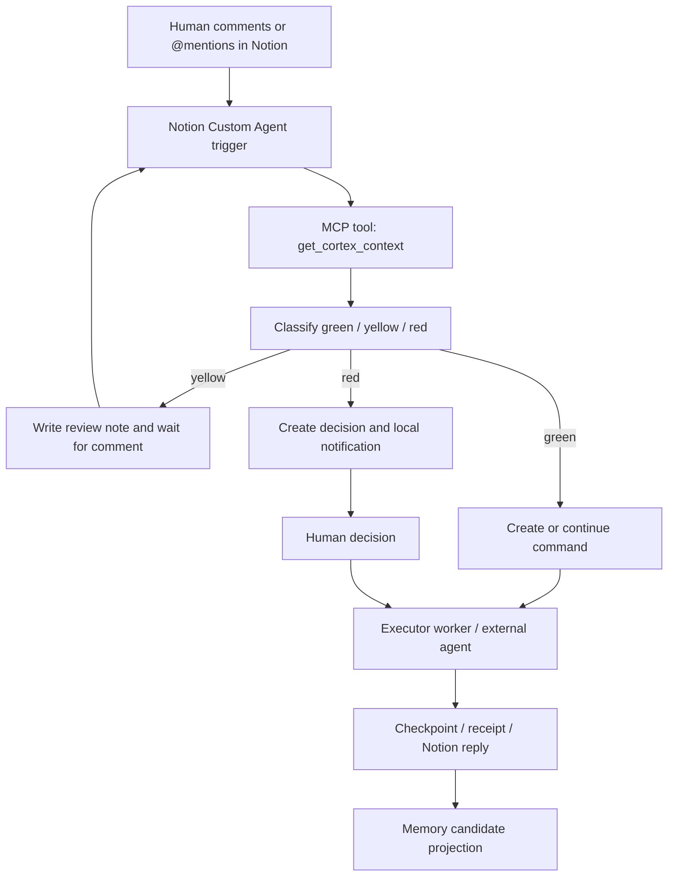
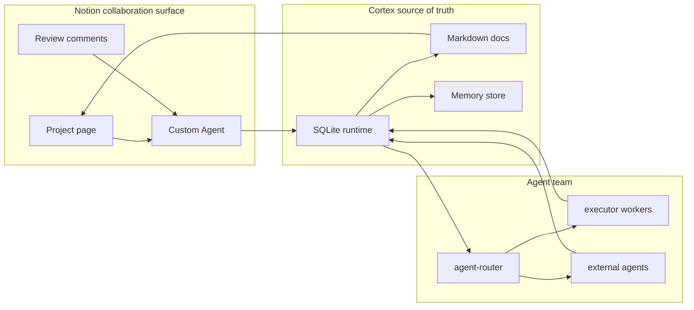

# Notion Custom Agents Async Collaboration

最近更新：2026-04-29

## 结论

`Notion Custom Agents` 是 Cortex 在 Notion 内异步协作的正式主路径。  
旧的 `notion-loop` 评论轮询已经退出主 runtime，不再继续维护为并行模式。

## 当前落地状态

- `2026-04-29` 已在当前本机 Cortex runtime 上执行 `npm run agent:live-uat -- --template-project PRJ-cortex --project PRJ-cortex-live-uat-20260429 --agent agent-live-uat-runtime`
- 6 个核心场景已全部通过：
  - `green -> command`
  - `yellow -> decision_request`
  - `red -> decision_request + outbox`
  - `self-loop guard`
  - `scope guard`
  - `receipt -> command done + checkpoint`
- 同一轮验收里，red 场景产生的临时 outbox 已自动归档，`remaining_pending_count = 0`
- `npm run runtime:soak -- --project PRJ-cortex --iterations 2 --interval-ms 500 --samples 1` 也已返回 `status = ready`
- `npm run agent:setup-bundle -- --project PRJ-cortex` 已确认当前唯一 blocker 是 `public_mcp_url_missing`
- 现在剩下的不是 Cortex 侧 contract，而是 Notion UI 里的最后一段人工挂接：
  - 把公网 MCP endpoint 挂到目标 `Custom Agent`
  - 打开 trigger
  - 让 Notion agent 在 discussion 内真实回帖

## 目标形态

用户旅程：

1. 你在 Notion 页面或评论中直接 `@Cortex Router`
2. `Notion Custom Agent` 被原生触发
3. Custom Agent 调用 Cortex MCP 工具获取上下文与写入动作
4. Cortex 落库 `command / decision / checkpoint / memory`
5. 需要回复时，由 Custom Agent 直接回到当前 Notion discussion
6. 红灯事项由 Cortex 继续走本地系统通知



## OpenAgents 借鉴点

参考项目：[openagents-org/openagents](https://github.com/openagents-org/openagents)。

它的成熟设计对 Cortex 有 5 个直接借鉴点：

- `Unified workspace`：OpenAgents 把人和多个 agent 放进同一个 workspace；Cortex 不新增前台，而是把 Notion 页面 / discussion 当成人机异步 workspace，把 SQLite + Markdown 当成真相源。
- `Event-driven collaboration`：OpenAgents 强调 agent 响应事件而不是持续轮询；Cortex 的正式路径也是 Notion Custom Agent 原生触发，而不是本地评论轮询。
- `@mention delegation`：OpenAgents 支持在同一线程里通过 `@mention` 拉 agent 进来；Cortex 保留 `@mention / route_to / owner_agent`，但真正的任务归属写入 command，而不是只依赖评论文本。
- `Task lifecycle`：OpenAgents 的 task delegation 有 assigned / progress / completed / failed / timeout；Cortex 对应使用 `commands / runs / checkpoints / agent_receipts / decisions`，并把状态变化同步回 Notion。
- `Shared artifacts`：OpenAgents 让 agents 共享文件、线程和浏览器；Cortex P0 只共享文档工件：review page、execution page、memory page、project index。

不照搬的部分：

- 不引入新的浏览器 workspace 或 Native 前台。
- 不把 Notion 变成唯一真相源。
- 不在 P0 做开放式多 Custom Agents 编排。
- 不要求所有 agent 都接入同一个实时 chat UI。

## Cortex P0 协作模型



| OpenAgents pattern | Cortex P0 mapping | P0 acceptance |
|---|---|---|
| Workspace URL | Notion project page + Cortex local server | Human can review one page and continue work from comments |
| Agent roster | `docs/agent-registry.json` + Connect API | Agents are discoverable and routable |
| Thread message | Notion discussion event | One comment creates one command or action |
| Task delegation | `commands / owner_agent / route_to` | Assigned agent can claim, execute, and complete |
| Progress report | `runs / checkpoints / receipts` | Notion shows latest checkpoint and doc-level progress |
| Human decision | `decision_requests` + local notification | Red decisions wait for human approval |
| Shared memory | `memory_items / memory_sources` | Durable memory keeps source, evidence, confidence, freshness |

## Cortex 侧职责

- 真相源：本地 Markdown + SQLite
- 执行内核：`commands / decisions / runs / checkpoints / outbox / receipts`
- 记忆治理：`memory_items / memory_sources / review_state`
- 红灯通知：`local_notification`
- 结构化上下文：`GET /project-review` 与 `GET /notion/custom-agent/context`
- Notion agent 事件入口：`POST /webhook/notion-custom-agent`
- MCP 工具门面：`src/cortex-mcp-server.js`

## Notion 侧职责

- 原生触发：`@mention agent` / `comment added`
- 原生对话：在页面和 discussion 内与 agent 交互
- 原生执行：agent 在 Notion 内决定是否继续、追问、回复当前线程

## 默认写入原则

- 默认主路径：`Notion Custom Agent + MCP`
- 默认真相源：`Cortex local Markdown + SQLite`
- 默认行为：本地 Cortex 进程不再主动用 `NOTION_API_KEY` 静默 push review / memory / execution / project index
- token-based Notion API 写入只保留为：
  - migration backfill
  - legacy mirror
  - 临时运维修复

也就是说：

- `评论 / @mention -> Custom Agent -> MCP tools -> Cortex API` 是正式主路径
- `本地脚本主动把页面写回 Notion` 不再是默认能力
- 异步回执结果默认只进入 `receipt / checkpoint / docs`，不再由本地 token 回写 discussion

## 迁移原则

- `notion-loop` 已移出默认 runtime
- `NOTION_COLLAB_MODE=custom_agent` 作为默认模式
- 现有 `/webhook/notion-comment` 保留兼容，不作为主入口

## P0 落地范围

- 先用一个 `Cortex Router` Custom Agent 收口主协作入口
- 先保留 Cortex 现有 `agent-router / agent-pm / agent-architect / agent-evaluator / agent-notion-worker`
- 先不做多 Custom Agents 编排
- 先不做开放式自然语言 agent orchestration

## P0 接入计划

### Phase 1：一个 Router Agent

目标：Notion 里只配置一个 `Cortex Router` Custom Agent，所有评论和 mention 都先进入 Router。

详细配置清单与联调步骤见：

- [docs/notion-custom-agent-router-checklist.md](./notion-custom-agent-router-checklist.md)

验收：

- Notion comment 或 `@Cortex Router` 可以触发 agent。
- Router 能调用 `GET /notion/custom-agent/context`。
- Router 能把事件写入 `POST /webhook/notion-custom-agent`。
- Cortex 侧生成 command，并保留 `page_id / discussion_id / comment_id / owner_agent`。

### Phase 1 Notion 侧配置清单

在 Notion 里，P0 先只落一个 `Cortex Router`：

1. 创建一个 `Notion Custom Agent`，名称固定为 `Cortex Router`。
2. 打开两个触发器：
   - `The agent is mentioned in a page or comment`
   - `A comment is added to a page`
3. 给它的系统职责写清 4 件事：
   - 先读当前 page / discussion / comment 上下文
   - 调 `get_cortex_context` 拉 Cortex 当前项目态
   - 判断 `green / yellow / red`
   - 再调 `ingest_notion_comment` 把事件写回 Cortex
4. 允许它访问的 Cortex API 先限制在最小闭环：
   - `get_cortex_context`
   - `ingest_notion_comment`
   - `claim_next_command`
   - `submit_agent_receipt`
5. Router 的 system prompt 不要写成开放式大总管，而要写成一个明确的事件路由器：
   - 先归类事件，再决定是否继续执行、在 Notion 线程内追问等待、或升级为红灯决策
   - 不把 Notion 当真相源
   - 所有 durable 状态都回 Cortex
6. 当前阶段不配置第二个 Custom Agent。
   - 其他 agent 仍然是 Cortex 内部的 `owner_agent`
   - Notion 里先只暴露 `Cortex Router` 这一个入口
7. 打开 `comment added` 触发器时，必须同时配置防回环。
   - agent 自己在 discussion 里的回复，不应该再次进入 Cortex 形成自触发循环
   - 最稳妥的做法是 payload 里显式带 `self_authored=true`
   - 如果 Notion 侧方便拿到 actor id，也可以传 `created_by.id` + `invoked_agent_actor_id`
8. 同时配置项目页面边界，不要让 Router 在 workspace 里到处吃评论。
   - 如果评论可能发生在项目子页面，payload 里要带 `page_ancestry_ids`
   - Cortex 会用 `page_id / target_id / page_ancestry_ids` 去判断这条评论是否属于当前项目页面树

### Phase 1 Router Prompt 骨架

可以直接按这个结构去配置 Notion 侧说明：

```text
You are Cortex Router, the single async entrypoint for Cortex collaboration in Notion.

Your job:
1. Read the current page/comment context.
2. Fetch Cortex project context with the MCP tool get_cortex_context.
3. Classify the incoming event as green, yellow, or red.
4. Call ingest_notion_comment with page_id, discussion_id, comment_id, body, invoked_agent, owner_agent, source_url, and optional route_to.
5. For green and yellow items, continue collaboration in Notion comments.
6. For red items, stop execution and let Cortex trigger the local human notification flow.

Rules:
- Cortex local Markdown + SQLite is the source of truth.
- Notion is the async collaboration surface.
- Do not silently skip red-risk decisions.
- Prefer explicit owner_agent routing when the human instruction already implies a role.
```

### Phase 2：任务委派生命周期

目标：把 OpenAgents 的 task lifecycle 映射到 Cortex 内核。

验收：

- `assigned`：command 写入 `owner_agent`。
- `progress`：agent 写入 run / checkpoint。
- `completed`：agent receipt 标记 command done，并把结果摘要暴露给 Notion 侧 agent 在当前 discussion 中回显。
- `failed`：agent receipt 标记失败，并生成 review item。
- `timed_out`：P0 暂不自动 timeout，只在后续补 watchdog。

### Phase 3：红黄绿分流

目标：把用户旅程固定为红灯 push、黄绿入文档。

验收：

- `green`：agent 继续执行并沉淀 checkpoint。
- `yellow`：写入 review page，等待 Notion 异步评论。
- `red`：写入 decision request，触发 `local_notification`。

### Phase 4：记忆沉淀

目标：每个重要节点都能形成可审核的 candidate memory。

验收：

- 通过 checkpoint / approved decision / accepted suggestion / human preference 生成 candidate。
- reviewer-agent 先给建议。
- human reviewer 最终裁定是否进入 durable memory。
- curator-agent 只负责后续冲突、重复、冗余和 freshness 维护。

## 建议的 Custom Agent 配置

触发器：

- `The agent is mentioned in a page or comment`
- `A comment is added to a page`

系统职责：

- 读取当前页面与评论上下文
- 调用 Cortex context 接口获取项目状态
- 判断是 `green / yellow / red`
- 对 `green / yellow` 在 Notion 内继续推进
- 对 `red` 调用 Cortex 决策接口，由 Cortex 发送本地系统通知

工具 / API：

- `GET /notion/custom-agent/context?project_id=PRJ-cortex`
- `POST /webhook/notion-custom-agent`
- `GET /commands?project_id=PRJ-cortex`
- `POST /commands/claim-next`
- `POST /webhook/agent-receipt`

最小事件载荷：

```json
{
  "project_id": "PRJ-cortex",
  "page_id": "notion-page-id",
  "discussion_id": "notion-discussion-id",
  "comment_id": "notion-comment-id",
  "body": "human instruction or review comment",
  "invoked_agent": "Cortex Router",
  "owner_agent": "agent-router",
  "source_url": "notion://page/notion-page-id/discussion/notion-discussion-id/comment/notion-comment-id"
}
```

推荐补充字段：

```json
{
  "target_type": "page_comment",
  "target_id": "notion-block-or-page-id",
  "context_quote": "the paragraph or task sentence around the comment",
  "anchor_block_id": "optional notion block id",
  "route_to": "agent-pm",
  "self_authored": false,
  "page_ancestry_ids": ["ancestor-page-id", "project-parent-page-id"],
  "created_by": {
    "id": "notion-user-id",
    "type": "person_or_bot",
    "name": "comment author"
  },
  "invoked_agent_actor_id": "notion-user-id-of-cortex-router"
}
```

## 防回环规则

参考 `openclaw-notion-comment` 这类 Notion 评论协作实现，一个真实好用的异步读评链路必须处理“自己回复自己”的回环问题。

Cortex 当前约定是：

1. `Custom Agent` 自己写出的评论，不应再次落成新的 command / decision
2. 最优先信号是：
   - `self_authored=true`
3. 其次也支持：
   - `created_by.id`
   - `actor_id`
   - `invoked_agent_actor_id`
4. 命中防回环时，`/webhook/notion-custom-agent` 会返回：
   - `skipped=true`
   - `skip_reason=self_authored_comment`
   - `workflow_path=ignored`

这层保护的目的不是“少处理一条评论”，而是防止 Router 在 Notion discussion 中因为自己的回复不断再触发自己。

## 页面边界规则

除了防回环，Cortex 还会做项目页面边界检查。

当前规则是：

1. 如果项目已经配置了这些页面 id：
   - `root_page_url`
   - `notion_parent_page_id`
   - `notion_review_page_id`
   - `notion_memory_page_id`
   - `notion_scan_page_id`
2. 那么 `Custom Agent` 发来的事件，必须至少有一个 scope id 命中这些页面：
   - `page_id`
   - `target_id`
   - `page_ancestry_ids`
3. 如果没有命中，Cortex 会返回：
   - `skipped=true`
   - `skip_reason=out_of_scope_page`
   - `workflow_path=ignored`

最重要的一条实践：

- 如果 Notion 评论可能出现在项目子页面而不是根页面，`page_ancestry_ids` 一定要传
- 否则 Cortex 无法区分“这是项目子页”还是“这是完全无关的另一个页面”

Webhook 响应约定：

- `workflow_path=command`
  - 表示当前 comment 已进入普通执行链路
  - 返回 `command_id / owner_agent`
- `workflow_path=decision_request`
  - 表示当前 comment 已被 Router 判成 `yellow / red`
  - 返回 `decision_id / signal_level / decision`
  - `red` 还会额外返回 `outbox_queued=true`

路由建议：

- 默认先写 `owner_agent=agent-router`。
- 如果评论里有明确的 `[agent: agent-pm]` 或 `route_to=agent-pm`，Router 可以把 `owner_agent` 改成目标 agent。
- 如果是红灯决策，Router 不直接继续执行，而是创建 decision request。
- 如果是 memory candidate，Router 先进入 reviewer-agent 建议，再等待 human reviewer 裁定。

## Phase 1 联调 Checklist

联调顺序不要一上来就跑全链路，先按这 6 步验：

1. Context 可读
   - 用浏览器或 API 工具请求 `GET /notion/custom-agent/context?project_id=PRJ-cortex`
   - 确认返回里有 `collaboration_mode=custom_agent`
   - 确认返回里带 `async_contract.ingress_webhook=/webhook/notion-custom-agent`
2. Router 可写入
   - 用固定 payload 手动调用一次 `POST /webhook/notion-custom-agent`
   - 确认返回 `ok=true`
   - 确认拿到 `commandId` 和 `owner_agent`
3. Green case
   - 在 Notion 评论一个明确执行型动作，例如“整理当前 P0 阻塞并继续推进”
   - 预期：落 command，owner_agent 为 router 或明确指定 agent，后续进入执行
4. Yellow case
   - 在 Notion 评论一个需要澄清但不阻塞的问题
   - 预期：Router 在当前讨论线程说明待确认点，并把状态写到 review 文档，不触发本地通知
5. Red case
   - 在 Notion 评论一个高风险决策，例如“直接覆盖现有对外文档结构”
   - 预期：Cortex 创建 decision request，并走本地系统通知
6. Receipt 回流
   - 模拟 executor 完成后回调 `POST /webhook/agent-receipt`
   - 预期：command 状态关闭，Notion discussion 可收到结果摘要

## Optional Legacy Mirroring

只有在你明确选择继续保留 `NOTION_API_KEY` 那套本地镜像脚本时，下面这段排障才有意义。

如果你走的是纯 `Custom Agent + MCP` 协作路径，可以直接跳过这一节。

## Workspace 迁移与权限排障

先明确一个最容易把人绕晕的事实：

- `Notion MCP OAuth` 和本地 `.env.local` 里的 `NOTION_API_KEY` 不是同一条鉴权链路
- 前者决定 Codex / Custom Agent / MCP 工具能不能“看见”某个 workspace
- 后者决定 Cortex 这套本地 `notion:bootstrap`、`memory:notion-sync`、`notion:sync-all` 脚本能不能写进去
- 所以会出现一种常见错觉：
  - 你已经在 Codex 里重新 OAuth 到了新 workspace
  - `mcp__notion__` 已经能 fetch 新页面
  - 但本地同步脚本仍然 404
  - 根因通常不是“Notion 抽风”，而是 `NOTION_API_KEY` 还在用旧 workspace 的 internal integration

### 新 workspace 的正确迁移顺序

1. 先修 MCP OAuth
   - 运行 `codex mcp logout notion`
   - 再运行 `codex mcp login notion`
   - OAuth 时明确选择新的 Notion workspace
   - 重启 Codex
   - 用 `mcp__notion__.notion_fetch` 或在对话里直接 fetch 新 root page，确认 MCP 真的能看到新页面
2. 再修 token-based sync
   - 在新的 Notion workspace 里创建或选择一个 `internal integration`
   - 给它一个稳定名称，例如 `codex-sync` 或 `cortex-sync`
   - 复制新的 `Internal Integration Secret`
   - 更新本地 `.env.local` 里的 `NOTION_API_KEY`
3. 给新 root page 授权
   - 打开新的 root page
   - 用页面右上角菜单的 `Add connections`
   - 把刚才那一个 integration 加到这张页面，或直接加到它的父页面
   - 如果后续要在这一棵树下创建 review / memory / execution 子页面，最稳妥的是直接分享父页面
4. 最后再跑 Cortex 脚本
   - 先跑 `npm run notion:diagnose -- "https://www.notion.so/your-root-page-id"`
   - 再跑 `npm run notion:bootstrap -- "https://www.notion.so/your-root-page-id"`
   - 最后跑 `npm run notion:sync-all`

### 你应该看到的健康信号

- `mcp__notion__.notion_fetch` 能读到新页面
- `npm run notion:diagnose` 里：
  - `notion_api.accessible=true`
  - `targets[0].accessible=true`
  - `diagnosis.status=ready`
- `cortex.project` 在 bootstrap 之后切换到新的 `root/review/memory/scan` 页面 id

### 如果又卡住，优先怎么判别

1. MCP 能看见，新脚本 404
   - 说明 `NOTION_API_KEY` 仍旧不对，或者新页面没有分享给 token 对应的 integration
2. 新脚本能看见，MCP 看不见
   - 说明 OAuth 还在旧 workspace，需要重新登录 MCP
3. 两边都看不见
   - 先确认页面确实在目标 workspace 里
   - 再确认不是分享了错误的页面副本或数据库视图
4. 两边都能看见，但 bootstrap 仍失败
   - 再检查是不是本地 `PROJECT_ID / NOTION_PARENT_PAGE_ID / ROOT_PAGE_URL` 仍指向旧页面
   - 此时通常不是授权问题，而是项目配置还没切过去

如果切了新 Notion workspace，不要直接假设“授权完成就能用”，先跑一次诊断：

```bash
npm run notion:diagnose -- "https://www.notion.so/your-root-page-id"
```

看 3 个结果：

1. `notion_api.accessible`
   - `true` 说明本地 `NOTION_API_KEY` 至少是有效的
2. `targets[].accessible`
   - `false` 说明目标页没有共享给当前 integration
   - 错误体里的 `integration_id` 就是需要在 Notion 里核对的那个集成
3. `cortex.project`
   - 这里能直接看到当前项目还指向哪些旧的 `root/review/memory/scan` 页面

P0 的迁移顺序应当是：

1. 先让新 root page 对 token-based integration 可见
2. 再确认 Notion MCP OAuth 也能 fetch 到新页面
3. 再跑 `notion:bootstrap`
4. 最后跑 `notion:sync-all`

## 兼容说明

以下能力继续保留，但降级为兼容层：

- `/webhook/notion-comment`
- `docs/notion-routing.json`
