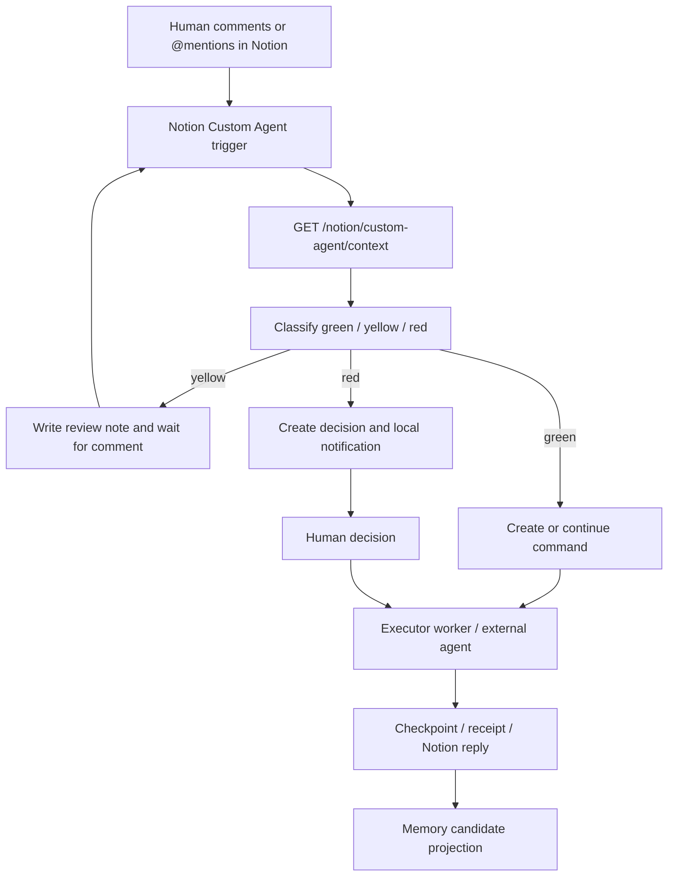
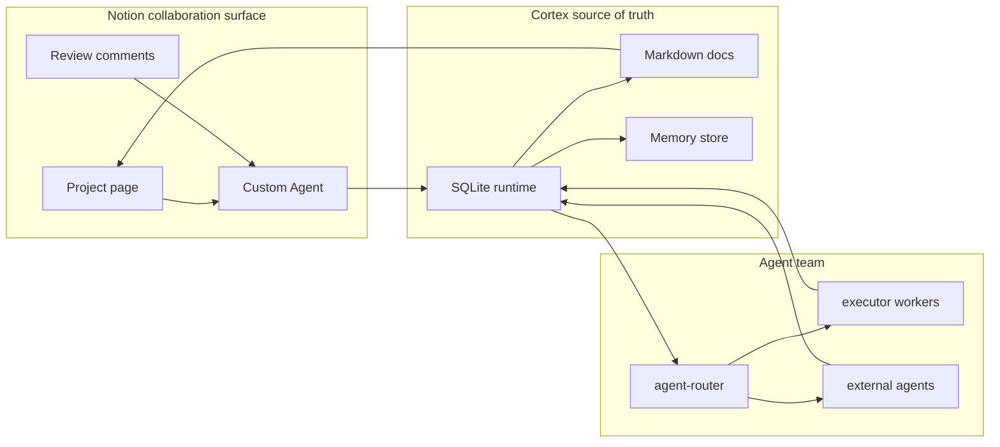

# Notion Custom Agents Async Collaboration

最近更新：2026-04-21

## 结论

`Notion Custom Agents` 是 Cortex 在 Notion 内异步协作的正式主路径。  
旧的 `notion-loop` 评论轮询只保留为 `legacy fallback`，不再作为默认运行模式。

## 目标形态

用户旅程：

1. 你在 Notion 页面或评论中直接 `@Cortex Router`
2. `Notion Custom Agent` 被原生触发
3. Custom Agent 直接调用 Cortex API / MCP 工具获取上下文与写入动作
4. Cortex 落库 `command / decision / checkpoint / memory`
5. 需要回复时，由 Custom Agent 直接回到当前 Notion discussion
6. 红灯事项由 Cortex 继续走本地系统通知



## OpenAgents 借鉴点

参考项目：[openagents-org/openagents](https://github.com/openagents-org/openagents)。

它的成熟设计对 Cortex 有 5 个直接借鉴点：

- `Unified workspace`：OpenAgents 把人和多个 agent 放进同一个 workspace；Cortex 不新增前台，而是把 Notion 页面 / discussion 当成人机异步 workspace，把 SQLite + Markdown 当成真相源。
- `Event-driven collaboration`：OpenAgents 强调 agent 响应事件而不是持续轮询；Cortex 的正式路径也应是 Notion Custom Agent 原生触发，`notion-loop` 只做 legacy fallback。
- `@mention delegation`：OpenAgents 支持在同一线程里通过 `@mention` 拉 agent 进来；Cortex 保留 `@mention / route_to / owner_agent`，但真正的任务归属写入 command，而不是只依赖评论文本。
- `Task lifecycle`：OpenAgents 的 task delegation 有 assigned / progress / completed / failed / timeout；Cortex 对应使用 `commands / runs / checkpoints / agent_receipts / decisions`，并把状态变化同步回 Notion。
- `Shared artifacts`：OpenAgents 让 agents 共享文件、线程和浏览器；Cortex P0 只共享文档工件：review page、execution page、memory page、project index。

不照搬的部分：

- 不引入新的浏览器 workspace 或 Native 前台。
- 不把 Notion 变成唯一真相源。
- 不在 P0 做开放式多 Custom Agents 编排。
- 不要求所有 agent 都接入同一个实时 chat UI。

## Cortex P0 协作模型



| OpenAgents pattern | Cortex P0 mapping | P0 acceptance |
|---|---|---|
| Workspace URL | Notion project page + Cortex local server | Human can review one page and continue work from comments |
| Agent roster | `docs/agent-registry.json` + Connect API | Agents are discoverable and routable |
| Thread message | Notion discussion event | One comment creates one command or action |
| Task delegation | `commands / owner_agent / route_to` | Assigned agent can claim, execute, and complete |
| Progress report | `runs / checkpoints / receipts` | Notion shows latest checkpoint and discussion reply |
| Human decision | `decision_requests` + local notification | Red decisions wait for human approval |
| Shared memory | `memory_items / memory_sources` | Durable memory keeps source, evidence, confidence, freshness |

## Cortex 侧职责

- 真相源：本地 Markdown + SQLite
- 执行内核：`commands / decisions / runs / checkpoints / outbox / receipts`
- 记忆治理：`memory_items / memory_sources / review_state`
- 红灯通知：`local_notification`
- 结构化上下文：`GET /project-review` 与 `GET /notion/custom-agent/context`
- Notion agent 事件入口：`POST /webhook/notion-custom-agent`

## Notion 侧职责

- 原生触发：`@mention agent` / `comment added`
- 原生对话：在页面和 discussion 内与 agent 交互
- 原生执行：agent 在 Notion 内决定是否继续、追问、回帖

## 迁移原则

- `notion-loop` 不再默认启动
- `NOTION_COLLAB_MODE=custom_agent` 作为默认模式
- 只有显式 `legacy_polling` 才启动评论轮询
- 现有 `/webhook/notion-comment` 保留兼容，不作为主入口

## P0 落地范围

- 先用一个 `Cortex Router` Custom Agent 收口主协作入口
- 先保留 Cortex 现有 `agent-router / agent-pm / agent-architect / agent-evaluator / agent-notion-worker`
- 先不做多 Custom Agents 编排
- 先不做开放式自然语言 agent orchestration

## P0 接入计划

### Phase 1：一个 Router Agent

目标：Notion 里只配置一个 `Cortex Router` Custom Agent，所有评论和 mention 都先进入 Router。

验收：

- Notion comment 或 `@Cortex Router` 可以触发 agent。
- Router 能调用 `GET /notion/custom-agent/context`。
- Router 能把事件写入 `POST /webhook/notion-custom-agent`。
- Cortex 侧生成 command，并保留 `page_id / discussion_id / comment_id / owner_agent`。

### Phase 2：任务委派生命周期

目标：把 OpenAgents 的 task lifecycle 映射到 Cortex 内核。

验收：

- `assigned`：command 写入 `owner_agent`。
- `progress`：agent 写入 run / checkpoint。
- `completed`：agent receipt 标记 command done，并回帖 Notion discussion。
- `failed`：agent receipt 标记失败，并生成 review item。
- `timed_out`：P0 暂不自动 timeout，只在后续补 watchdog。

### Phase 3：红黄绿分流

目标：把用户旅程固定为红灯 push、黄绿入文档。

验收：

- `green`：agent 继续执行并沉淀 checkpoint。
- `yellow`：写入 review page，等待 Notion 异步评论。
- `red`：写入 decision request，触发 `local_notification`。

### Phase 4：记忆沉淀

目标：每个重要节点都能形成可审核的 candidate memory。

验收：

- 通过 checkpoint / approved decision / accepted suggestion / human preference 生成 candidate。
- reviewer-agent 先给建议。
- human reviewer 最终裁定是否进入 durable memory。
- curator-agent 只负责后续冲突、重复、冗余和 freshness 维护。

## 建议的 Custom Agent 配置

触发器：

- `The agent is mentioned in a page or comment`
- `A comment is added to a page`

系统职责：

- 读取当前页面与评论上下文
- 调用 Cortex context 接口获取项目状态
- 判断是 `green / yellow / red`
- 对 `green / yellow` 在 Notion 内继续推进
- 对 `red` 调用 Cortex 决策接口，由 Cortex 发送本地系统通知

工具 / API：

- `GET /notion/custom-agent/context?project_id=PRJ-cortex`
- `POST /webhook/notion-custom-agent`
- `GET /commands?project_id=PRJ-cortex`
- `POST /commands/claim-next`
- `POST /webhook/agent-receipt`

最小事件载荷：

```json
{
  "project_id": "PRJ-cortex",
  "page_id": "notion-page-id",
  "discussion_id": "notion-discussion-id",
  "comment_id": "notion-comment-id",
  "body": "human instruction or review comment",
  "invoked_agent": "Cortex Router",
  "owner_agent": "agent-router",
  "source_url": "notion://page/notion-page-id/discussion/notion-discussion-id/comment/notion-comment-id"
}
```

路由建议：

- 默认先写 `owner_agent=agent-router`。
- 如果评论里有明确的 `[agent: agent-pm]` 或 `route_to=agent-pm`，Router 可以把 `owner_agent` 改成目标 agent。
- 如果是红灯决策，Router 不直接继续执行，而是创建 decision request。
- 如果是 memory candidate，Router 先进入 reviewer-agent 建议，再等待 human reviewer 裁定。

## 兼容说明

以下能力继续保留，但降级为兼容层：

- `scripts/notion-loop.js`
- `scripts/notion-comment-smoke.js`
- `/webhook/notion-comment`
- `docs/notion-routing.json`
